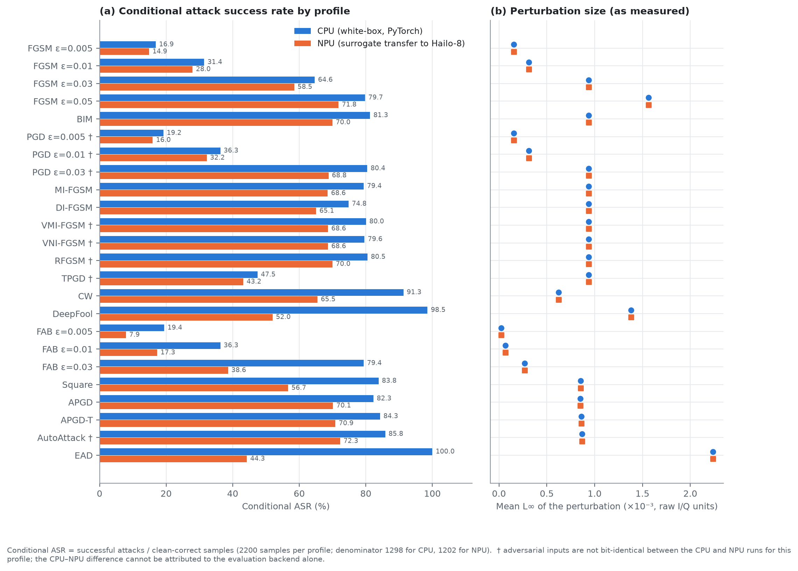
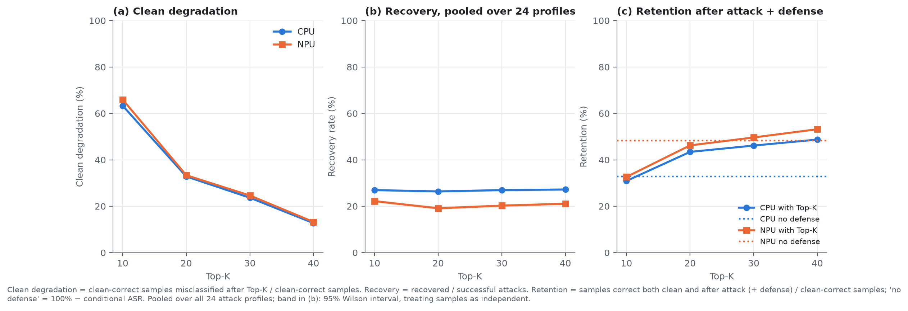

# Executive Summary — AWN 於 CPU 與 Hailo-8 NPU 之對抗攻擊遷移、Top-K 防禦與延遲

**資料集**：RadioML 2016.10a（11 調變 × 20 SNR × 10 樣本 = 2200）　｜　**攻擊**：17 種演算法、24 個 profile　｜　**防禦**：FFT Top-K，K ∈ {10, 20, 30, 40}

所有數字由兩組正式 full-matrix 原始 CSV 重新計算，資料驗證 113 項全數通過（[`analysis/phase_a_validation.md`](analysis/phase_a_validation.md)）。完整分析見 [`meeting_report.md`](meeting_report.md)。

**威脅模型**：A0 digital classifier-input attack。NPU 端為 **surrogate-model transfer attack**：對抗樣本由 PyTorch surrogate 生成，再送入量化後的 Hailo-8 模型評估；**並非**對 Hailo 模型的白箱攻擊。

## 主要結果

| # | 結果 | 數值 |
|---|---|---|
| 1 | **Clean 準確度**（量化代價） | CPU 59.00%、NPU 54.64%，差 −4.36 pp；預測一致率 90.73%。差距集中於 GFSK（−32.0 pp）；排除 GFSK 後為 −1.60 pp。 |
| 2 | **攻擊成功率**（conditional ASR，24 profile 合併） | CPU（白箱）**67.20%**；NPU（transfer）**51.65%**。 |
| 3 | **遷移落差** | 在對抗輸入 bit-identical 的 16 個 profile 上，NPU ASR 平均低 19.0 pp。梯度符號類攻擊落差小（−2 至 −13 pp）；DeepFool、EAD、CW、FAB、Square 落差大（−12 至 −56 pp）。AM-DSB 幾乎不遷移（ASR 79.4% → 7.3%）。 |
| 4 | **Top-K 防禦代價** | Clean degradation：K=10 為 63–66%，K=40 仍有約 13%。 |
| 5 | **Top-K 防禦效益** | 24 profile 合併 recovery：CPU 26–27%、NPU 19–22%，對 K 不敏感。淨 retention 增益：CPU +10.6 至 +15.9 pp（K ≥ 20）；NPU 僅在 K ≥ 30 為正（+1.3 至 +4.8 pp），K=10、20 為負。K=10 的 recovery 主要來自預測塌縮至少數類別。 |
| 6 | **推論加速** | Clean 推論中位延遲 CPU 3.21 ms、NPU 0.54 ms，**5.96×**（平均 5.60×，p95 5.74×，p99 5.63×）。 |
| 7 | **端到端加速** | Sensing + 推論：**1.50×**（中位）／1.44×（平均）。約 4.3 ms 的 sensing 前處理在 host 端，占 NPU 端到端平均延遲的 89%。 |

## 圖表

| | |
|---|---|
|  |  |
| **圖 2**　各攻擊 profile 的條件式 ASR：CPU 白箱 vs. NPU surrogate transfer | **圖 5**　Top-K 的 clean degradation、recovery 與 retention |

## 結論

1. 量化部署的 clean 準確度代價（−4.4 pp）小於它對遷移攻擊成功率的影響（平均 −19 pp），且兩者皆強烈依賴調變類型。
2. NPU 對 surrogate 遷移攻擊的 ASR 較低，但合併 ASR 仍達 51.65%；不應將其視為可依賴的對抗穩健性。本實驗未評估針對量化模型的白箱或 query-based 攻擊。
3. 固定 K 的 Top-K 去噪需以 clean 準確度為代價；淨效益出現在 K ≥ 20（CPU）或 K ≥ 30（NPU），且幅度有限。
4. 5.6–6.0× 的 NPU 推論加速在系統層僅為 1.4–1.5×；下一個瓶頸是 host 端的 sensing 前處理與 Top-K。

## 主要限制

- 8 個 profile（PGD ×3、VMI-FGSM、VNI-FGSM、RFGSM、TPGD、AutoAttack）的對抗輸入在 CPU 與 NPU 兩次執行間並非 bit-identical，其 CPU–NPU 差異不可單獨歸因於評估 backend。
- 每格僅 10 個樣本（總計 2200）；同一批樣本重複用於各 profile 與 K，信賴區間與 p 值假設獨立，僅供相對比較。
- 僅評估 A0 digital 攻擊與固定超參數的攻擊 profile，不構成攻擊強度排名。
- 詳見 [`meeting_report.md` §10](meeting_report.md#10-限制與有效性威脅)。
