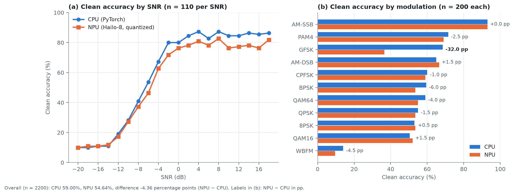
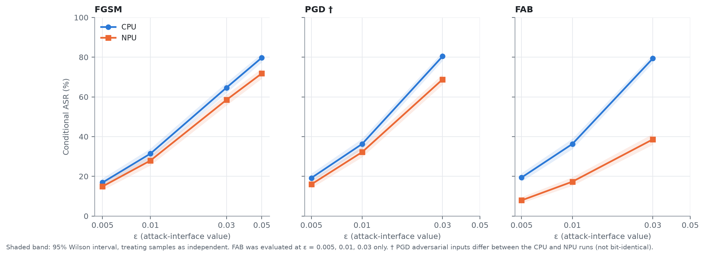
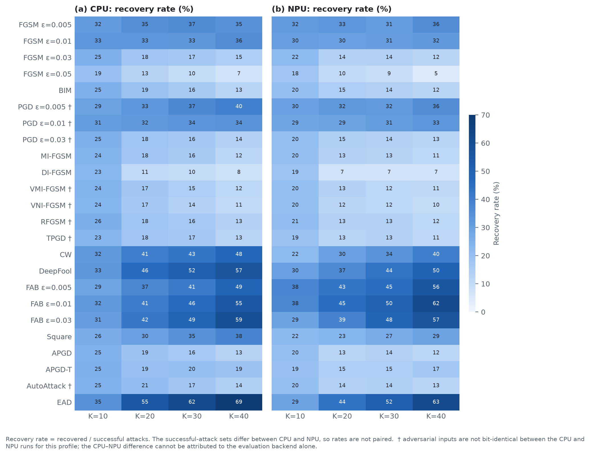
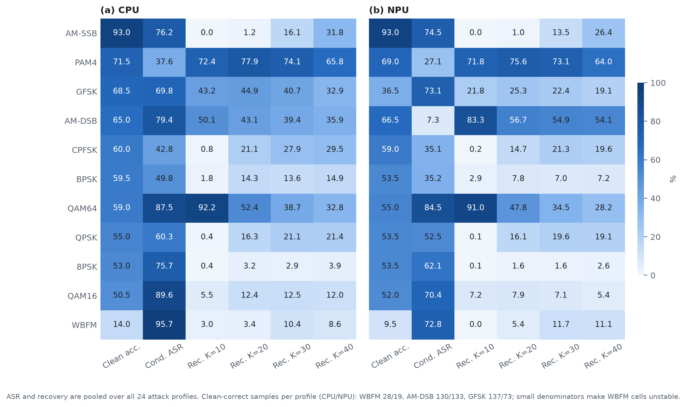
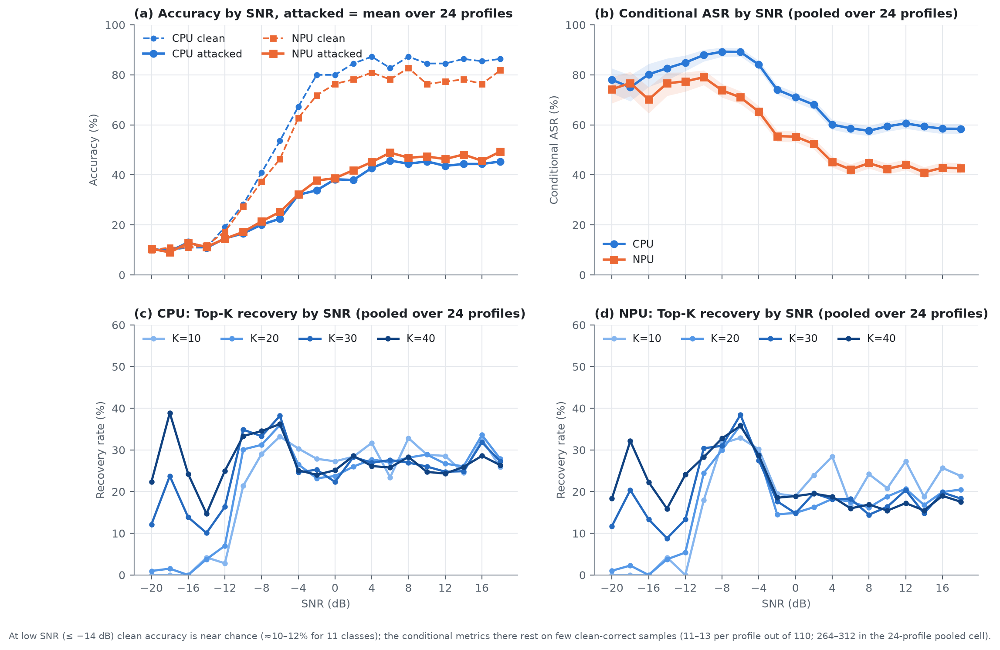
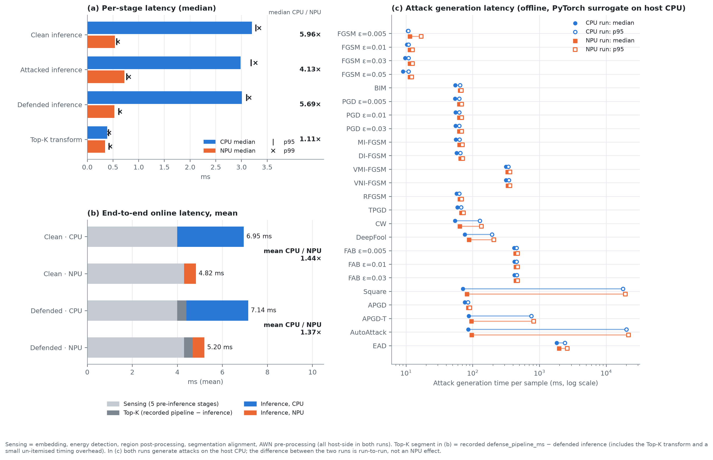

# RadioML 2016.10a AWN：CPU 與 Hailo-8 NPU 上的對抗攻擊遷移、Top-K 防禦與延遲評估

**會議日期**：2026-09-21　｜　**資料集**：RadioML 2016.10a　｜　**模型**：AWN（PyTorch 原模型 / 量化後部署於 Hailo-8 之 HEF）

> 本報告的所有數字均由兩組正式 full-matrix 實驗的原始 CSV 重新計算而得，並經 113 項資料驗證（`FORMAL DATA VALIDATION: PASS`，見 [`analysis/phase_a_validation.md`](analysis/phase_a_validation.md)）。未使用 pilot、subset、debug 或舊 seed 的結果。

---

## 目錄

1. [摘要](#1-摘要)
2. [實驗設定與威脅模型](#2-實驗設定與威脅模型)
3. [Clean baseline：CPU 與 NPU 的分類效能](#3-clean-baselinecpu-與-npu-的分類效能)
4. [對抗攻擊與 surrogate-model 遷移](#4-對抗攻擊與-surrogate-model-遷移)
5. [Top-K 頻域防禦](#5-top-k-頻域防禦)
6. [依調變類型分析](#6-依調變類型分析)
7. [依 SNR 分析](#7-依-snr-分析)
8. [延遲與加速比](#8-延遲與加速比)
9. [端到端解讀](#9-端到端解讀)
10. [限制與有效性威脅](#10-限制與有效性威脅)
11. [檔案索引與重現方式](#11-檔案索引與重現方式)
12. [附錄：指標定義](#12-附錄指標定義)

---

## 1. 摘要

| 面向 | 主要結果（n = 2200 個 clean 樣本；24 個攻擊 profile；Top-K ∈ {10, 20, 30, 40}） |
|---|---|
| Clean 準確度 | CPU **59.00%**、NPU **54.64%**，差 **−4.36 個百分點（pp）**；預測一致率 90.73%（1996 / 2200）。差距主要來自 GFSK（−32.0 pp）；排除 GFSK 後為 58.05% vs 56.45%（−1.60 pp）。 |
| 攻擊（CPU） | 在 PyTorch 原模型上以白箱方式生成並評估，24 個 profile 的條件式攻擊成功率（conditional ASR）介於 16.9%（FGSM ε=0.005）與 100.0%（EAD），24 profile 合併為 **67.20%**。 |
| 攻擊（NPU） | 對抗樣本由 PyTorch surrogate 生成，再送入量化後的 Hailo-8 模型評估（**surrogate-model transfer attack**）。條件式 ASR 介於 7.9%（FAB ε=0.005）至 72.3%（AutoAttack），合併為 **51.65%**。 |
| 遷移落差 | 在對抗輸入 bit-identical 的 16 個 profile 上，NPU 條件式 ASR 平均低於 CPU **19.0 pp**。梯度符號類攻擊（FGSM、BIM、MI/DI-FGSM、APGD 系列）落差小（−2 至 −13 pp）；邊界搜尋／最小範數類攻擊（DeepFool、EAD、CW、FAB）與 Square 落差大（CW −25.8、Square −27.2、DeepFool −46.5、EAD −55.7 pp；FAB −11.5 至 −40.8 pp）。 |
| Top-K 防禦 | 24 profile 合併的 recovery rate：CPU 26.4–27.2%、NPU 19.1–22.2%，對 K 幾乎不敏感；clean degradation 隨 K 由 63–66%（K=10）降至 13%（K=40）。K=10 的「復原」主要是預測塌縮至少數類別的副產物，而非真實還原。相較無防禦，**只有 K ≥ 20（CPU）或 K ≥ 30（NPU）時整體 retention 才為正增益**。 |
| 延遲 | NPU 推論中位延遲 0.54 ms，相對 CPU 的 3.21 ms 為 **5.96×**；但含 sensing 前處理的**端到端 clean 延遲僅加速 1.50×（中位）／1.44×（平均）**，因為約 4.3 ms 的 sensing 前處理皆在 host 端執行，佔 NPU 端到端平均延遲的 89%。 |

**核心結論**：(i) 量化部署本身造成的 clean 準確度差距（−4.4 pp）小於它對遷移攻擊成功率的影響（平均 −19 pp）；(ii) 遷移攻擊的有效性強烈依賴攻擊演算法與被攻擊調變類型（AM-DSB 的 ASR 由 79.4% 降至 7.3%）；(iii) 固定 K 的 Top-K 去噪在高 K 才有淨效益，且以犧牲 clean 準確度為代價；(iv) 加速的瓶頸已轉移到 host 端的 sensing 前處理。

---

## 2. 實驗設定與威脅模型

### 2.1 資料與正式結果來源

| 項目 | 內容 |
|---|---|
| 資料集 | RadioML 2016.10a（11 種調變、20 個 SNR：−20 至 +18 dB，步階 2 dB） |
| 樣本 | 每個（調變 × SNR）格 10 筆，共 **2200** 個 clean 樣本；`base_seed = 42` |
| Sensing 前處理 | 將訊號嵌入 8192 點的緩衝區 → 能量偵測 → 區域後處理 → 128 點 segment 對齊（`max-energy`）→ AWN 前處理（`radioml-native`） |
| 攻擊 | 17 種演算法、共 **24 個 profile**（FGSM 4 個 ε、PGD 3 個 ε、FAB 3 個 ε，其餘為單一預設 profile），每個 profile 對全部 2200 個樣本 → 52,800 筆 |
| 防禦 | 固定 K 的 FFT Top-K 去噪（`fft_topk_denoise`）；K ∈ {10, 20, 30, 40}，作用於 128 點 segment → 211,200 筆 |
| CPU 正式結果 | `results/cpu_full_matrix_20260921_seedaligned` |
| NPU 正式結果 | `results/hailo_full_matrix_20260920_seedaligned` |

兩組結果的 dataset 與 checkpoint SHA-256 一致；NPU 使用之 HEF 的 SHA-256 已重新計算並與 manifest 一致。兩組實驗的 (調變, SNR, sample_index) 逐列一對一對齊，label、seed、segment 位置、偵測區域與 `clean_input_sha256` 皆 0 筆不一致。

### 2.2 威脅模型

兩組實驗皆採 **A0：digital classifier-input attack**（攻擊者直接修改分類器的輸入 I/Q，不經過無線通道）。

- **CPU 實驗**：對抗樣本由可微分的 PyTorch AWN 生成，並在同一個 PyTorch AWN 上評估（白箱）。
- **NPU 實驗**：對抗樣本**仍由可微分的 PyTorch AWN surrogate 於 host CPU 上生成**，再送入量化後部署於 Hailo-8 的 AWN 評估。因此 NPU 端的攻擊為 **surrogate-model transfer attack**：攻擊者無法對 Hailo-8 上的量化模型取得梯度，**不是** Hailo 上的白箱攻擊。

### 2.3 指標定義

以下定義已於 Phase A 對照原始資料驗證（完整定義見[附錄](#12-附錄指標定義)）：

- `attack_success = clean_correct ∧ ¬attacked_correct`；**conditional ASR = Σ attack_success / Σ clean_correct**（只計 clean 分類正確者，避免把本來就分錯的樣本算成攻擊成功）。
- `clean_degraded = clean_correct ∧ ¬clean_topk_correct`；**clean degradation = Σ clean_degraded / Σ clean_correct**。
- `recovered = attack_success ∧ defended_correct`；**recovery rate = Σ recovered / Σ attack_success**。
- **Retention** = 「clean 正確且經攻擊（＋防禦）後仍正確」的樣本數 / clean 正確樣本數；無防禦時 retention = 100% − conditional ASR。Retention 同時計入 clean degradation 與 recovery，是評估防禦淨效益的較完整指標。
- 百分點（pp）用於兩個百分比之差；百分比（%）用於比率本身。

> **CPU 與 NPU 的 conditional ASR 分母不同**（CPU：1298 個 clean 正確樣本；NPU：1202 個），因此兩者的 ASR 不是在同一組樣本上比較。§4.2 另提供「雙方皆 clean 正確」的共同子集（n = 1172）上的配對比較。

---

## 3. Clean baseline：CPU 與 NPU 的分類效能



**圖 1**　Clean 準確度：(a) 依 SNR；(b) 依調變類型。（資料：[`tables/clean_summary.csv`](tables/clean_summary.csv)）

| 指標 | 數值 |
|---|---:|
| CPU 準確度 | 59.00%（1298 / 2200） |
| NPU 準確度 | 54.64%（1202 / 2200） |
| 差異（NPU − CPU） | −4.36 pp |
| 預測一致 | 1996 / 2200 = 90.73% |
| 兩者皆正確 / 兩者皆錯誤 | 1172 / 872 |
| 僅 CPU 正確 / 僅 NPU 正確 | 126 / 30 |
| 精確 McNemar 檢定（雙尾） | p = 3.4 × 10⁻¹⁵ |

**觀察**

1. 兩個 backend 的差異**不對稱**：CPU 正確而 NPU 錯誤者（126）遠多於相反者（30），與量化造成的系統性退化一致；在 (調變, SNR, sample) 配對下此差異顯著（見 §10 對樣本獨立性的說明）。
2. 差距集中在 **GFSK**：CPU 68.5%、NPU 36.5%（−32.0 pp），兩者預測一致率僅 64%。混淆矩陣顯示 NPU 將 62 個 GFSK 樣本判為 WBFM，CPU 僅 5 個（[`tables/clean_confusion_cpu_npu.csv`](tables/clean_confusion_cpu_npu.csv)）。排除 GFSK 後，整體準確度為 CPU 58.05%、NPU 56.45%（−1.60 pp）。其餘調變的差異落在 −6.0 至 +1.5 pp（BPSK −6.0 pp 為次大）。
3. **SNR 依賴**：SNR ≤ −14 dB 時兩者皆接近隨機猜測（11 類，約 10–12%）；SNR ≥ 2 dB 後 CPU 約 82–87%、NPU 約 76–83%，呈平台。兩者之差在 −6 至 +18 dB 約為 4–9 pp。
4. WBFM 的 clean 準確度極低（CPU 14.0%、NPU 9.5%），這使 WBFM 相關的條件式指標分母很小（見 §6）。

---

## 4. 對抗攻擊與 surrogate-model 遷移

### 4.1 各 profile 的攻擊成功率


**圖 2**　(a) 各 profile 的條件式 ASR（藍：CPU 白箱；橙：NPU surrogate transfer）；(b) 實測擾動平均 L∞。† 表示該 profile 的對抗輸入在 CPU 與 NPU 兩次執行間**並非 bit-identical**（見 §4.3）。（資料：[`tables/attack_summary.csv`](tables/attack_summary.csv)、[`tables/cpu_npu_transfer_comparison.csv`](tables/cpu_npu_transfer_comparison.csv)）

| # | Profile | 對抗輸入 bit-identical | CPU ASR (%) | NPU ASR (%) | ΔASR (pp) | 雙方 clean-correct 子集 ΔASR (pp) | 平均 L∞ (×10⁻³) | 平均 L2 |
|---:|---|---:|---:|---:|---:|---:|---:|---:|
| 1 | FGSM ε=0.005 | 全部 | 16.9 | 14.9 | -2.0 | +0.1 | 0.16 | 0.0025 |
| 2 | FGSM ε=0.01 | 全部 | 31.4 | 28.0 | -3.5 | -1.5 | 0.31 | 0.0050 |
| 3 | FGSM ε=0.03 | 全部 | 64.6 | 58.5 | -6.2 | -5.4 | 0.94 | 0.0150 |
| 4 | FGSM ε=0.05 | 全部 | 79.7 | 71.8 | -7.9 | -7.7 | 1.56 | 0.0249 |
| 5 | BIM | 全部 | 81.3 | 70.0 | -11.3 | -9.5 | 0.94 | 0.0136 |
| 6 | PGD ε=0.005 † | 0.0% | 19.2 | 16.0 | -3.2 | -1.1 | 0.16 | 0.0024 |
| 7 | PGD ε=0.01 † | 0.0% | 36.3 | 32.2 | -4.1 | -2.6 | 0.31 | 0.0047 |
| 8 | PGD ε=0.03 † | 0.0% | 80.4 | 68.8 | -11.6 | -9.8 | 0.94 | 0.0134 |
| 9 | MI-FGSM | 全部 | 79.4 | 68.6 | -10.8 | -9.2 | 0.94 | 0.0141 |
| 10 | DI-FGSM | 全部 | 74.8 | 65.1 | -9.7 | -9.2 | 0.94 | 0.0142 |
| 11 | VMI-FGSM † | 0.0% | 80.0 | 68.6 | -11.4 | -9.8 | 0.94 | 0.0142 |
| 12 | VNI-FGSM † | 0.3% | 79.6 | 68.6 | -10.9 | -9.4 | 0.94 | 0.0143 |
| 13 | RFGSM † | 0.0% | 80.5 | 70.0 | -10.5 | -9.0 | 0.94 | 0.0135 |
| 14 | TPGD † | 0.0% | 47.5 | 43.2 | -4.3 | -4.5 | 0.94 | 0.0134 |
| 15 | CW | 全部 | 91.3 | 65.5 | -25.8 | -25.9 | 0.62 | 0.0068 |
| 16 | DeepFool | 全部 | 98.5 | 52.0 | -46.5 | -45.3 | 1.38 | 0.0060 |
| 17 | FAB ε=0.005 | 全部 | 19.4 | 7.9 | -11.5 | -9.5 | 0.02 | 0.0003 |
| 18 | FAB ε=0.01 | 全部 | 36.3 | 17.3 | -19.0 | -17.5 | 0.07 | 0.0010 |
| 19 | FAB ε=0.03 | 全部 | 79.4 | 38.6 | -40.8 | -39.4 | 0.27 | 0.0038 |
| 20 | Square | 全部 | 83.8 | 56.7 | -27.2 | -25.9 | 0.85 | 0.0136 |
| 21 | APGD | 全部 | 82.3 | 70.1 | -12.1 | -10.4 | 0.85 | 0.0123 |
| 22 | APGD-T | 全部 | 84.3 | 70.9 | -13.4 | -11.6 | 0.86 | 0.0112 |
| 23 | AutoAttack † | 8.1% | 85.8 | 72.3 | -13.5 | -11.7 | 0.87 | 0.0126 |
| 24 | EAD | 全部 | 100.0 | 44.3 | -55.7 | -54.9 | 2.24 | 0.0057 |

*「雙方 clean-correct 子集 ΔASR」：僅在 CPU 與 NPU 皆 clean 分類正確的 1172 個樣本上計算 ASR 之差（NPU − CPU），使兩個 backend 的分母相同。攻擊 profile 的排列順序與實驗 manifest 相同。*

**觀察**

1. **CPU（白箱）**：24 個 profile 的條件式 ASR 介於 16.9%（FGSM ε=0.005）與 100.0%（EAD），24 profile 合併為 67.20%。CW（91.3%）、DeepFool（98.5%）與 EAD（100.0%）的 ASR 最高；但這三者的實測平均 L∞（約 0.6、1.4、2.2 ×10⁻³）與多數 ε=0.03 的 profile（約 0.94 ×10⁻³）不同，不宜與固定 ε 的 profile 在同一擾動預算下比較。
2. **NPU（transfer）**：條件式 ASR 介於 7.9%（FAB ε=0.005）與 72.3%（AutoAttack），合併為 51.65%。24 個 profile 中有 21 個在共同 clean-correct 子集上的 CPU–NPU 差異達 p < 0.05（精確 McNemar 檢定，未做多重比較校正）。
3. **遷移落差依攻擊類型而異**（對抗輸入 bit-identical 的 16 個 profile）：
   - *小落差（−2 至 −13 pp）*：FGSM、BIM、MI-FGSM、DI-FGSM、APGD、APGD-T。FGSM ε=0.005 在共同子集上 ΔASR = +0.1 pp（p = 1.0），可視為無差異。
   - *大落差*：CW（−25.8 pp）、Square（−27.2 pp）、DeepFool（−46.5 pp）、EAD（−55.7 pp），以及 FAB（ε=0.005 / 0.01 / 0.03：−11.5 / −19.0 / −40.8 pp）。DeepFool、EAD、CW、FAB 在 surrogate 上搜尋貼近決策邊界的擾動，其成功較依賴 surrogate 與目標模型決策邊界的一致程度；量化造成的邊界位移與此一致，但該機制未於本實驗中檢驗。Square 為隨機搜尋式攻擊，不屬此解釋範圍。
4. 各 profile 的平均 L∞、L2 在 CPU 與 NPU 兩次執行間幾乎相同（24 個 profile 的平均 L2 分別為 0.009940 與 0.009941），故 ASR 的差異不來自擾動強度不同。
5. 本結果**不構成「最強攻擊」排名**：各 profile 的超參數固定於單一預設值，未做逐一調參，且 ε 為攻擊介面參數，不同演算法間的實測擾動範數並不相同（圖 2b）。

### 4.2 ε 掃描



**圖 3**　FGSM、PGD、FAB 的條件式 ASR 隨 ε 之變化（陰影為 95% Wilson 區間，樣本視為獨立）。（資料：[`tables/attack_summary.csv`](tables/attack_summary.csv)）

- FGSM 與 PGD 的 ASR 隨 ε 單調上升；NPU 曲線整體低於 CPU，且差距隨 ε 增大而增大（FGSM：ε=0.005 時 −2.0 pp，ε=0.05 時 −7.9 pp）。
- FAB 的 CPU–NPU 落差最大（ε=0.03：79.4% vs 38.6%）。FAB 的 ε=0.005 對應平均 L∞ 僅約 0.02–0.03×10⁻³，遠小於其他 profile。
- FGSM 僅有 4 個、PGD 與 FAB 僅有 3 個 ε 值；曲線形狀不宜過度外推。

### 4.3 CPU 與 NPU 的對抗輸入並非完全一致（重要限制）

兩次執行的對抗樣本 SHA-256 在 52,800 筆中有 35,384 筆相同、**17,416 筆不同**。不同者集中於 8 個 profile：PGD（3 個 ε）、VMI-FGSM、VNI-FGSM、RFGSM、TPGD 與 AutoAttack（圖表中標記 †）；其餘 16 個 profile 的對抗輸入完全 bit-identical。這 8 個 profile 的相對 L2 差異中位數約為 0.5%–2.1%（AutoAttack 的最大 |ΔL∞| = 1.08×10⁻³，其餘 profile 記錄之 L∞ 相同）。

**因此，† profile 的 CPU–NPU ASR 差異不能單獨歸因於評估 backend**，還混雜了對抗樣本本身的差異；本報告在這些 profile 上只陳述觀察到的數值，不做 backend 因果歸因。**§4.1 的「遷移落差」平均值與分類僅以 16 個 bit-identical profile 為依據。**

> 在對抗輸入 bit-identical 的列上，CPU 與 NPU 的攻擊後預測仍有 25.8% 不同，符合 §3 觀察到的 backend 預測差異（clean 預測不一致率 9.3%），亦說明兩個 backend 對受擾動輸入的決策差異被放大。

---

## 5. Top-K 頻域防禦

### 5.1 防禦代價與整體效益


**圖 5**　24 個 profile 合併後：(a) clean degradation；(b) recovery rate（陰影為 95% Wilson 區間，樣本視為獨立）；(c) retention，虛線為無防禦基準（= 100% − conditional ASR）。（資料：[`tables/defense_pooled_by_topk.csv`](tables/defense_pooled_by_topk.csv)、[`tables/clean_topk_summary.csv`](tables/clean_topk_summary.csv)）

| Backend | K | Clean degradation (%) | Recovery (%) | Retention with Top-K (%) | Retention 無防禦 (%) | 淨增益 (pp) |
|---|---:|---:|---:|---:|---:|---:|
| CPU | 10 | 63.33 | 26.95 | 30.90 | 32.80 | **−1.90** |
| CPU | 20 | 32.82 | 26.37 | 43.41 | 32.80 | +10.61 |
| CPU | 30 | 23.65 | 26.95 | 46.14 | 32.80 | +13.34 |
| CPU | 40 | 12.71 | 27.21 | 48.73 | 32.80 | +15.92 |
| NPU | 10 | 65.97 | 22.19 | 32.63 | 48.35 | **−15.72** |
| NPU | 20 | 33.36 | 19.11 | 46.22 | 48.35 | **−2.13** |
| NPU | 30 | 24.63 | 20.26 | 49.64 | 48.35 | +1.29 |
| NPU | 40 | 13.23 | 21.08 | 53.18 | 48.35 | +4.83 |

**觀察**

1. **Clean degradation 隨 K 遞減**（63% → 13%），兩個 backend 幾乎重合。在 K=10 時，8PSK、AM-SSB、BPSK、QPSK 的 clean-correct 樣本幾乎全數被誤判（degradation 99–100%）。
2. **Recovery rate 對 K 幾乎不敏感**（CPU 26.4–27.2%、NPU 19.1–22.2%），但這是 24 個 profile 平均的結果；各 profile 的趨勢相反（§5.2）。
3. **淨效益需同時看 retention**：無防禦時 NPU 的 retention（48.35%）本就高於 CPU（32.80%）——因為 NPU 上的攻擊 ASR 較低。因此對 NPU 而言，Top-K 需 K ≥ 30 才能超越無防禦基準（+1.3 至 +4.8 pp），K=10 與 20 為負增益。CPU 則從 K=20 起有明顯淨增益（+10.6 至 +15.9 pp）。
4. **K=10 的 recovery 不應解讀為有效防禦。** 證據：
   - K=10 時，Top-K 後 clean 預測的前 4 個最常見類別合計占 86.7%（CPU）／86.5%（NPU）；K=30–40 時為 53–60%（[`tables/clean_topk_pred_distribution.csv`](tables/clean_topk_pred_distribution.csv)），顯示預測塌縮到少數類別。
   - K=10 時，recovered 樣本中有 79.1%（CPU）／86.8%（NPU）屬於 QAM64、PAM4、AM-DSB 三類。這三類的 K=10 recovery 為 QAM64 92.2%／91.0%、PAM4 72.4%／71.8%、AM-DSB 50.1%／83.3%（CPU／NPU）；除 GFSK（43.2%／21.8%）外，其餘調變皆低於 8%（圖 7）。
   - 與 K=10 的負淨增益一致：recovery 主要出現在被塌縮預測「碰巧命中」的類別。此為與資料一致的解讀；本實驗未直接檢驗塌縮的成因。

### 5.2 各 profile 的 recovery rate



**圖 4**　各 profile × K 的 recovery rate（左：CPU；右：NPU）。CPU 與 NPU 的「攻擊成功樣本集合」不同，因此兩側的比率並非配對比較。（資料：[`tables/defense_summary.csv`](tables/defense_summary.csv)）

| Profile | CPU K=10 | K=20 | K=30 | K=40 | NPU K=10 | K=20 | K=30 | K=40 |
|---|---:|---:|---:|---:|---:|---:|---:|---:|
| FGSM ε=0.005 | 31.5 | 35.2 | 36.5 | 34.7 | 31.8 | 33.0 | 31.3 | 36.3 |
| FGSM ε=0.01 | 32.8 | 33.1 | 32.6 | 36.0 | 30.4 | 30.1 | 30.7 | 32.1 |
| FGSM ε=0.03 | 25.4 | 17.8 | 16.8 | 14.8 | 21.8 | 13.7 | 13.8 | 12.2 |
| FGSM ε=0.05 | 19.4 | 13.0 | 9.7 | 7.2 | 17.7 | 10.4 | 9.0 | 5.1 |
| BIM | 25.1 | 19.0 | 16.1 | 12.5 | 20.2 | 14.9 | 13.8 | 12.1 |
| PGD ε=0.005 † | 29.3 | 32.9 | 36.9 | 39.8 | 29.7 | 32.3 | 31.8 | 35.9 |
| PGD ε=0.01 † | 31.2 | 32.1 | 33.5 | 34.0 | 28.7 | 29.5 | 31.3 | 33.3 |
| PGD ε=0.03 † | 25.4 | 18.1 | 16.5 | 13.5 | 20.3 | 14.6 | 13.8 | 12.7 |
| MI-FGSM | 24.4 | 17.7 | 15.9 | 11.8 | 19.9 | 13.2 | 13.1 | 11.4 |
| DI-FGSM | 23.0 | 10.5 | 9.7 | 8.1 | 18.5 | 7.3 | 6.6 | 6.9 |
| VMI-FGSM † | 24.4 | 17.2 | 14.9 | 11.7 | 19.9 | 13.5 | 11.6 | 10.8 |
| VNI-FGSM † | 23.5 | 16.6 | 13.6 | 10.6 | 20.4 | 12.2 | 11.6 | 9.7 |
| RFGSM † | 25.6 | 17.8 | 16.2 | 13.2 | 21.0 | 13.2 | 13.4 | 11.5 |
| TPGD † | 23.2 | 17.7 | 16.9 | 12.8 | 18.9 | 12.7 | 13.3 | 11.2 |
| CW | 32.3 | 40.5 | 43.0 | 48.1 | 21.7 | 30.0 | 34.1 | 40.2 |
| DeepFool | 32.6 | 46.1 | 51.8 | 56.5 | 29.9 | 36.8 | 43.5 | 49.6 |
| FAB ε=0.005 | 29.0 | 37.3 | 41.3 | 48.8 | 37.9 | 43.2 | 45.3 | 55.8 |
| FAB ε=0.01 | 32.3 | 41.0 | 46.3 | 55.2 | 37.5 | 45.2 | 50.5 | 61.5 |
| FAB ε=0.03 | 30.7 | 42.4 | 49.4 | 58.9 | 29.1 | 38.6 | 48.5 | 57.1 |
| Square | 26.4 | 29.9 | 34.6 | 38.1 | 21.9 | 23.3 | 26.7 | 29.4 |
| APGD | 24.8 | 18.8 | 16.4 | 13.1 | 20.2 | 12.6 | 13.9 | 12.0 |
| APGD-T | 25.1 | 19.4 | 19.8 | 18.7 | 19.2 | 14.9 | 15.0 | 17.0 |
| AutoAttack † | 24.7 | 20.6 | 17.4 | 14.1 | 20.0 | 13.7 | 14.2 | 12.7 |
| EAD | 34.6 | 54.9 | 61.9 | 68.7 | 29.1 | 44.0 | 51.7 | 62.6 |

**觀察**

- 兩類趨勢相反：**低擾動、最小範數型攻擊**（DeepFool、EAD、FAB、CW）的 recovery 隨 K 增大而上升（K=40：CPU 的 EAD 68.7%、FAB ε=0.03 58.9%；NPU 的 EAD 62.6%、FAB ε=0.01 61.5%）；**單步／迭代大步長攻擊**（FGSM ε≥0.03、BIM、MI/DI-FGSM、APGD）的 recovery 隨 K 增大而下降（FGSM ε=0.05：CPU 由 19% 降至 7%，NPU 由 18% 降至 5%）。此為觀察到的趨勢，其頻譜機制未於本實驗檢驗。
- 因此在 24 個 profile 上取平均會使「recovery 對 K 不敏感」，掩蓋 profile 間的對比。

---

## 6. 依調變類型分析



**圖 7**　各調變的 clean 準確度、conditional ASR（24 個 profile 合併）與各 K 的 recovery（左：CPU；右：NPU）。（資料：[`tables/attack_by_modulation.csv`](tables/attack_by_modulation.csv)、[`tables/defense_by_modulation.csv`](tables/defense_by_modulation.csv)）

**觀察**

1. **AM-DSB 的遷移幾乎完全失效**：conditional ASR 為 CPU 79.4%、NPU **7.3%**。在對抗輸入 bit-identical、且 CPU 與 NPU 皆 clean 正確的 AM-DSB 列（n = 1936）上，CPU 的攻擊後預測有 73.2% 為 WBFM，NPU 僅 2.5%（NPU 有 92.9% 維持 AM-DSB）。這顯示 surrogate 上找到的 AM-DSB→WBFM 擾動方向對量化模型不成立。
2. **GFSK 呈相反的組合**：NPU 的 clean 準確度大幅降低（−32.0 pp），但條件式 ASR 反而略高（CPU 69.8%、NPU 73.1%）。NPU 上的 GFSK clean-correct 樣本數僅為 CPU 的約一半（每個 profile 73 vs 137），估計較不穩定。
3. **相對抗性較高的調變**：QAM16（CPU 89.6%／NPU 70.4%）、QAM64（87.5%／84.5%）、WBFM（95.7%／72.8%，但分母小）。**相對較低**：PAM4（37.6%／27.1%）、CPFSK（42.8%／35.1%）、BPSK（49.8%／35.2%）。
4. **Top-K 的效益集中於少數調變**：K=40 時 recovery 最高者為 PAM4（65.8%／64.0%）、AM-DSB（35.9%／54.1%）、QAM64（32.8%／28.2%）；8PSK（3.9%／2.6%）與 QAM16（12.0%／5.4%）的復原能力最弱。AM-SSB 的 recovery 在 K=10、20 近 0（0.0–1.2%），K=40 才升至 31.8%／26.4%；其 clean degradation 在 K=10、20 為 100%，即該兩個 K 下所有原本分類正確的 AM-SSB 樣本皆被誤判。
5. **分母較小的格子應謹慎解讀**：WBFM 每個 profile 僅 28（CPU）／19（NPU）個 clean-correct 樣本；其 ASR 與 recovery 的變異大。

---

## 7. 依 SNR 分析



**圖 6**　(a) 各 SNR 的 clean 與攻擊後準確度（攻擊後為 24 個 profile 的平均）；(b) 各 SNR 的 conditional ASR（陰影：95% Wilson 區間）；(c)(d) 各 K 的 recovery（CPU、NPU）。（資料：[`tables/attack_by_snr.csv`](tables/attack_by_snr.csv)、[`tables/defense_by_snr.csv`](tables/defense_by_snr.csv)）

**觀察**

1. **低 SNR（≤ −14 dB）**：clean 準確度已接近隨機猜測（10–12%），此區間的條件式指標僅建立在極少的 clean-correct 樣本上（每個 profile 11–13 個，24 profile 合併 264–312 個），故 ASR 與 recovery 的波動不具穩定的統計意義。
2. **中低 SNR（−12 至 −4 dB）**：ASR 達峰值（CPU 89.3% 於 −8 dB；NPU 79.0% 於 −10 dB），此後隨 SNR 上升而下降。
3. **高 SNR（≥ 4 dB）**：ASR 趨於平台（CPU 約 58–61%、NPU 約 41–45%）。兩個 backend 的 ASR 差距（CPU − NPU）在 SNR ≥ −2 dB 時約為 13–19 pp。
4. **攻擊後準確度**（含原本分錯而攻擊後「碰巧」分對的樣本）：CPU 與 NPU 在多數 SNR 相近，高 SNR 時 NPU 略高（例如 8 dB：44.5% vs 46.9%）；24 個 profile 平均的攻擊後準確度為 CPU 30.77%、NPU 32.49%。NPU 較低的 clean 準確度因此被較低的 ASR 抵銷。
5. **Top-K recovery**：SNR ≥ −2 dB 時 CPU 的 recovery 約 22–34%，各 K 差異小；NPU 在 SNR ≥ −2 dB 時，K=10 的 recovery（約 17–28%）在多數 SNR 高於 K=20–40（約 14–21%）；−8 至 −6 dB 各 K 皆達約 29–38% 的局部峰值；SNR ≤ −12 dB 時 K=10、20 的 recovery 為 0–7%，K=30、40 為 9–39%（此區間樣本量極小）。

---

## 8. 延遲與加速比



**圖 8**　(a) 各階段延遲（中位數；標記為 p95、p99；右側為 CPU/NPU 中位數比值）；(b) 端到端線上延遲的組成（平均）；(c) 各 profile 的攻擊生成延遲（離線、host CPU；對數軸）。（資料：[`tables/latency_summary_cpu_npu.csv`](tables/latency_summary_cpu_npu.csv)、[`tables/attack_generation_latency.csv`](tables/attack_generation_latency.csv)）

所有統計量均由原始 CSV 重新計算，並與各實驗自帶的 `latency_summary.csv` 比對（最大相對誤差 < 10⁻¹⁵）。**加速比 = CPU 延遲 / NPU 延遲**。

| 階段 | CPU 平均 (ms) | NPU 平均 (ms) | 加速比（平均） | CPU 中位 (ms) | NPU 中位 (ms) | 加速比（中位） | 加速比 p95 | 加速比 p99 |
|---|---:|---:|---:|---:|---:|---:|---:|---:|
| Clean 推論 | 2.95 | 0.53 | **5.60×** | 3.21 | 0.54 | **5.96×** | 5.74× | 5.63× |
| 受攻擊樣本推論 | 2.80 | 0.71 | 3.95× | 2.98 | 0.72 | 4.13× | 4.14× | 4.05× |
| 防禦後推論 | 2.74 | 0.53 | 5.20× | 3.01 | 0.53 | 5.69× | 5.07× | 4.99× |
| Top-K 轉換（host） | 0.36 | 0.35 | 1.04× | 0.39 | 0.35 | 1.11× | 0.98× | 0.96× |
| Sensing 前處理（5 階段合計，host） | 4.00 | 4.30 | 0.93× | 4.50 | 4.60 | 0.98× | 0.99× | 0.99× |
| **端到端 clean（sensing + 推論）** | 6.95 | 4.82 | **1.44×** | 7.72 | 5.15 | **1.50×** | 1.50× | 1.50× |
| 端到端 defended（sensing + Top-K + 推論） | 7.14 | 5.20 | 1.37× | 7.27 | 5.49 | 1.32× | 1.43× | 1.42× |
| 攻擊生成（離線） | 351.33 | 376.30 | 0.93× | 63.06 | 66.64 | 0.95× | 0.93× | 0.92× |

**觀察**

1. **推論階段**：NPU 的 clean 推論加速 5.6×（平均）至 6.0×（中位），p95、p99 亦在 5.6–5.7×，顯示加速在尾端延遲上同樣成立。受攻擊樣本推論的加速較低（約 4.0–4.1×），因 NPU 端該階段的中位延遲較高（0.72 ms vs 0.54 ms）；其原因未於本實驗檢驗。
2. **端到端**：sensing 前處理（embedding、能量偵測、區域後處理、segment 對齊、AWN 前處理）在兩組實驗均於 host 端執行，平均約 4.0（CPU 實驗）與 4.3 ms（NPU 實驗），此差異為兩次執行間的變動，非 NPU 效應。NPU 端到端 clean 平均延遲 4.82 ms 中，**sensing 占 89%、推論僅占 11%**（CPU 實驗：58% vs 42%）。依 Amdahl 定律，即使 NPU 推論時間趨近於零，端到端加速也受限於約 6.95 / 4.30 ≈ 1.6×（以兩次實驗的平均值估算）。
3. **Top-K 轉換**（0.35–0.36 ms）在兩個實驗中皆於 host 端執行，加速比約 1×；Top-K 的線上延遲成本（約 0.4 ms）與 NPU 推論時間（0.53 ms）同一數量級。「端到端 defended」使用 runner 記錄的 `defense_pipeline_ms`，其中包含少量未逐項計時的額外開銷（平均 0.03–0.04 ms）。
4. **攻擊生成**（平均 351–376 ms；中位 63–67 ms；p99 約 2.5–2.7 s）是**離線 host CPU 成本**：兩組實驗都在 host CPU 上以 PyTorch surrogate 生成攻擊，兩者之差為 run-to-run 變動，**不代表 NPU 對攻擊生成的任何加速或減速**。攻擊生成時間依演算法差異極大（FGSM 約 10 ms；EAD 約 2 s；AutoAttack、Square 在 p95 達 10⁴ ms 量級）。

---

## 9. 端到端解讀

以 sensing → AWN 分類 → (攻擊) → (Top-K 防禦) 的完整管線觀察本實驗：

1. **效能面（clean）**：量化部署的準確度代價為 −4.36 pp，且集中於 GFSK 一類；排除 GFSK 後僅 −1.60 pp。在推論階段換得 5.6–6.0× 的加速。
2. **端到端延遲面**：推論加速在系統層僅呈現為 1.44–1.50×，瓶頸在 host 端的 sensing 前處理。若目標是降低端到端延遲，下一個優化標的是 sensing 與 Top-K 的 host 端實作，而非 NPU 推論。
3. **安全面（transfer attack）**：針對 PyTorch surrogate 生成的攻擊，遷移到量化 Hailo-8 模型時 ASR 平均下降 19 pp（bit-identical 的 16 個 profile），但仍有 51.65% 的合併 ASR；換言之，**量化並未帶來可依賴的對抗穩健性**，其「防護」效果強烈依賴攻擊類型與調變類型（例如 AM-DSB 幾乎完全不遷移）。本實驗僅評估 A0 digital 攻擊與 surrogate 遷移，**未評估**對量化模型直接取得梯度（或 query-based）的攻擊，因此上述數字不能作為 NPU 對抗穩健性的上界或下界。
4. **防禦面（Top-K）**：固定 K 的 Top-K 去噪帶來 clean 準確度的顯著損失（K=40 仍有約 13%）。在 CPU 上 K ≥ 20、在 NPU 上 K ≥ 30 才有正的 retention 淨增益，且最大淨增益（CPU +15.9 pp、NPU +4.8 pp）仍小。其效果依攻擊類型而異，對最小範數型攻擊較有效，對大步長梯度攻擊則隨 K 增大而變差。
5. **綜合**：在本實驗條件下，NPU 部署的效益在延遲（推論階段）明確；在對抗穩健性上，遷移攻擊的成功率下降但不足以視為防護；Top-K 需在 K 與 clean 代價間折衝，且部署於 NPU 時所需的 K 較大（因為 NPU 上無防禦的基準 retention 已較高）。

---

## 10. 限制與有效性威脅

1. **對抗輸入不完全一致**：8 個 profile（PGD ×3、VMI-FGSM、VNI-FGSM、RFGSM、TPGD、AutoAttack）的對抗樣本在 CPU 與 NPU 兩次執行間並非 bit-identical（§4.3）。這些 profile 的 CPU–NPU 差異不可單獨歸因於評估 backend。
2. **Surrogate-model transfer**：NPU 端的攻擊並非針對量化模型的白箱攻擊；ASR 反映的是「surrogate 到量化模型的遷移性」，不是量化模型的最壞情況穩健性。
3. **Threat model**：僅評估 A0（digital classifier-input）攻擊，未經過無線通道、硬體前端或時間同步。
4. **樣本量與獨立性**：每個（調變 × SNR）格僅 10 個樣本，總計 2200 個；同一批樣本重複用於 24 個 profile 與 4 個 K。表中的 95% Wilson 區間與 McNemar p 值假設樣本獨立，**在 24 profile 合併時低估不確定性**（樣本間高度相關），僅供相對比較，不應視為嚴格的推論統計。未做多重比較校正。
5. **條件式指標的分母**：Conditional ASR 與 recovery 的分母是 clean 正確（或攻擊成功）的樣本，會隨 backend、調變與 SNR 而變；低 SNR 與 WBFM、GFSK（NPU）的分母很小。
6. **攻擊 profile 為固定超參數**：未做調參，不構成攻擊強度排名；ε 為攻擊介面參數，不同演算法的實測擾動範數不同。
7. **Top-K 為固定 K**：未評估自適應 K；K=10 的 recovery 受預測塌縮影響（§5.1）。
8. **延遲量測**：兩組實驗為分開執行（不同日期），host 端階段的差異包含 run-to-run 變動；NPU 推論延遲為 runner 記錄的推論時間，manifest 未記錄硬體規格、軟體版本或 git commit，僅記錄 `base_seed = 42`。
9. **實驗設定檔命名**：兩份 manifest 的 `config.experiment_name` 均為 `hailo_full_matrix_20260919`（沿用共用設定檔的名稱），與結果目錄的日期不同；其餘設定（config 內容）兩者一致。

---

## 11. 檔案索引與重現方式

### 檔案

| 路徑 | 內容 |
|---|---|
| [`executive_summary.md`](executive_summary.md) | 一頁式結論摘要 |
| [`analysis/phase_a_validation.py`](analysis/phase_a_validation.py) / [`.md`](analysis/phase_a_validation.md) / [`.json`](analysis/phase_a_validation.json) | 正式資料驗證（113 項檢查） |
| [`analysis/phase_b_analysis.py`](analysis/phase_b_analysis.py) | 由原始 CSV 產生所有衍生表格 |
| [`analysis/phase_b_results.json`](analysis/phase_b_results.json) | 報告引用的彙總數值 |
| [`analysis/make_figures.py`](analysis/make_figures.py) | 由 `tables/` 產生圖 1–8 |
| [`figures/`](figures/) | 圖 1–8（PNG） |
| [`tables/`](tables/) | 衍生表格（CSV） |

主要表格：`clean_summary.csv`、`cpu_npu_prediction_agreement.csv`、`clean_confusion_cpu_npu.csv`、`attack_summary.csv`、`cpu_npu_transfer_comparison.csv`、`defense_summary.csv`、`defense_pooled_by_topk.csv`、`clean_topk_summary.csv`、`clean_topk_pred_distribution.csv`、`attack_by_modulation.csv`、`attack_by_snr.csv`、`defense_by_modulation.csv`、`defense_by_snr.csv`、`latency_summary_cpu_npu.csv`、`attack_generation_latency.csv`。

### 重現

分析腳本只讀取上述兩個正式結果目錄，不修改任何原始結果。需要 Python 3 與 `pandas`、`numpy`、`scipy`、`matplotlib`。

```bash
python reports/meeting_20260921/analysis/phase_a_validation.py   # 資料驗證
python reports/meeting_20260921/analysis/phase_b_analysis.py     # 表格
python reports/meeting_20260921/analysis/make_figures.py         # 圖
```

`results/` 已被 `.gitignore` 排除；本目錄下的 `tables/` 為可直接版控的衍生資料。

---

## 12. 附錄：指標定義

| 指標 | 定義 |
|---|---|
| Clean accuracy | Σ clean_correct / n |
| Attacked accuracy | Σ attacked_correct / n（含 clean 分錯但攻擊後「碰巧」分對者） |
| Conditional ASR | Σ attack_success / Σ clean_correct，其中 attack_success = clean_correct ∧ ¬attacked_correct |
| Clean degradation | Σ clean_degraded / Σ clean_correct，其中 clean_degraded = clean_correct ∧ ¬clean_topk_correct |
| Recovery rate | Σ recovered / Σ attack_success，其中 recovered = attack_success ∧ defended_correct |
| Retention（含防禦） | Σ (clean_correct ∧ defended_correct) / Σ clean_correct |
| Retention（無防禦） | Σ (clean_correct ∧ ¬attack_success) / Σ clean_correct = 100% − conditional ASR |
| 預測一致率 | CPU 與 NPU 的 clean 預測標籤相同的樣本比例 |
| 加速比 | CPU 延遲統計量 / NPU 延遲統計量（同一統計量：平均、中位、p95、p99） |
| 95% 信賴區間 | Wilson score interval，假設樣本獨立 |
| McNemar 檢定 | 精確二項檢定（雙尾），以不一致配對（b, c）檢定 b = c |
