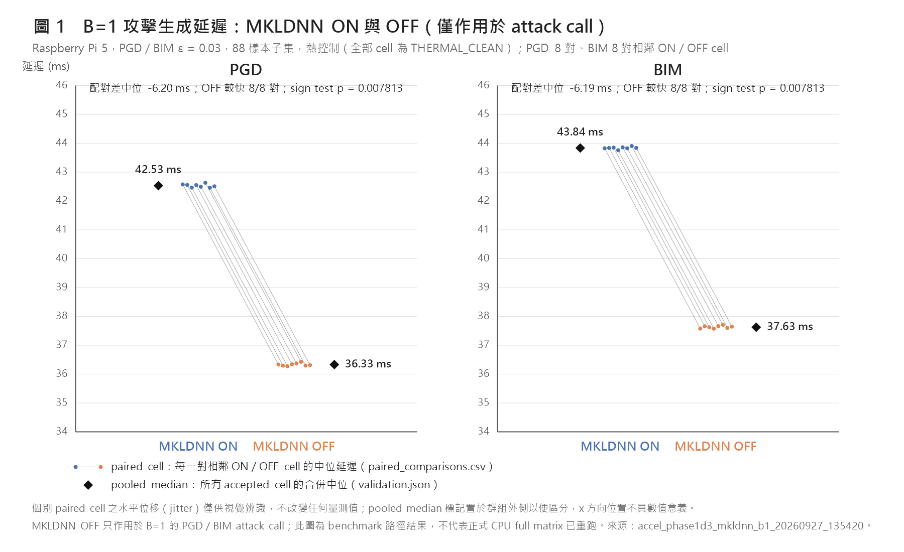
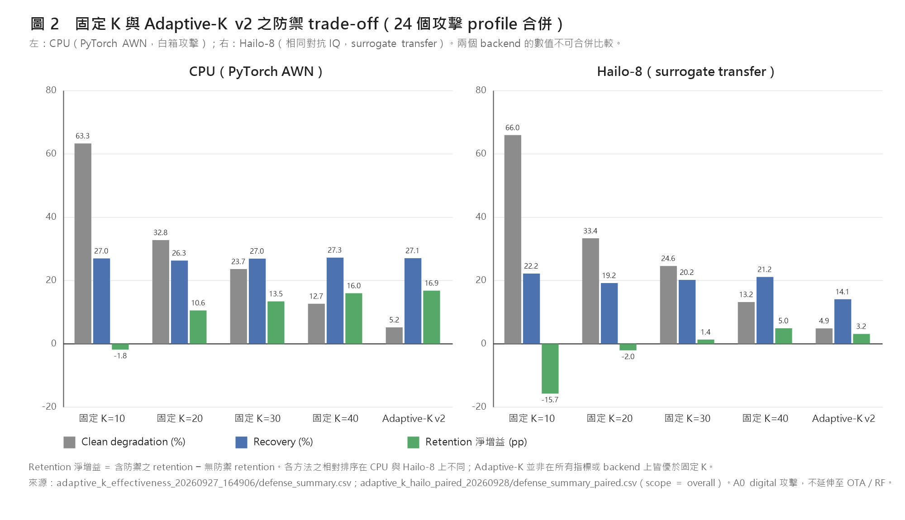
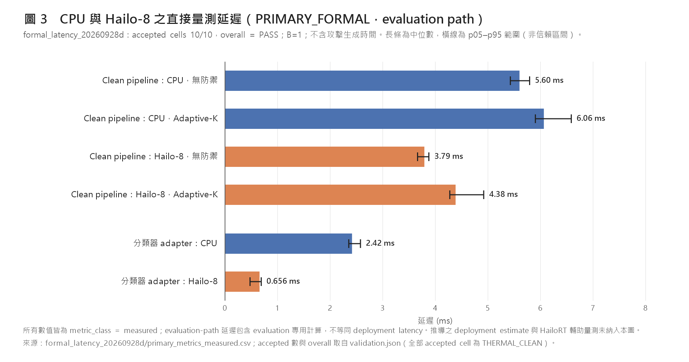

# Raspberry Pi 5 攻擊生成加速、Adaptive-K 防禦與 CPU／Hailo-8 正式延遲評估：研究進度報告

**報告日期**：2026-09-28　｜　**涵蓋期間**：2026-09-21 checkpoint 之後至 2026-09-28　｜　**平台**：Raspberry Pi 5（Cortex-A76 ×4）＋ Hailo-8　｜　**資料集**：RadioML 2016.10a　｜　**模型**：AWN（PyTorch 原模型／Hailo-8 HEF `awn_2016_10a_c5.hef`）

> 本報告所有數值皆取自 `meeting_20260928_evidence/results/` 內各實驗之 `validation.json`、`manifest.json`、`summary.csv` 及其他彙總檔，逐項標註來源。未完成、中止或未通過採用條件的 run 僅列於 §7 之 provenance 表，不作為結果引用。完整稽核紀錄見 [`analysis/evidence_audit.md`](analysis/evidence_audit.md)。

---

## 目錄

1. [摘要](#1-摘要)
2. [與前次 checkpoint 的銜接](#2-與前次-checkpoint-的銜接)
3. [研究線 A：Pi 5 上 B=1 攻擊生成的加速](#3-研究線-api-5-上-b1-攻擊生成的加速)
4. [研究線 B：Adaptive-K 實作一致性與防禦效果（CPU）](#4-研究線-badaptive-k-實作一致性與防禦效果cpu)
5. [研究線 C：Hailo-8 配對評估](#5-研究線-chailo-8-配對評估)
6. [研究線 D：正式延遲量測方法學與結果](#6-研究線-d正式延遲量測方法學與結果)
7. [未採用之 run 與 provenance](#7-未採用之-run-與-provenance)
8. [證據間不一致或目前無法判定之處](#8-證據間不一致或目前無法判定之處)
9. [限制與有效性威脅](#9-限制與有效性威脅)
10. [研究工作 traceability：既有待辦 → 本次完成 → 仍未完成](#10-研究工作-traceability既有待辦--本次完成--仍未完成)
11. [後續工作](#11-後續工作)
12. [檔案索引](#12-檔案索引)

---

## 1. 摘要

| 研究線 | 本週可支持的結論（皆附條件） | 主要 evidence |
|---|---|---|
| A. 攻擊生成加速 | 在 88 樣本子集、B=1、熱控制條件下，僅在 PGD／BIM 的 `atk(x, y)` 呼叫期間關閉 oneDNN（mkldnn），中位延遲由 42.53 → 36.33 ms（PGD）與 43.84 → 37.63 ms（BIM），配對差中位數約 −6.2 ms（8/8 對皆較快，sign test p = 0.0078），攻擊輸出未出現語意差異。此選項已以 opt-in 方式整合至 `AttackAdapter`（`b1_pgd_bim_mkldnn_off`，預設 `False`），整合驗證 PASS；正式 CPU full matrix 尚未使用此選項重跑。Batching 可提高 throughput，但單一樣本的決策延遲並未降低。 | `accel_phase1d3_mkldnn_b1_20260927_135420`、`accel_phase1_final_integration_20260927_153520`、`accel_phase1c_v2_formal_20260926_164547`、`accel_phase1d0_thermal_20260927_092156` |
| B. Adaptive-K（CPU） | Parity 驗證結果為：production 實作與 reference 在真實資料（2200 clean、264 attacked）上的分支、K 與 Top-K 決策完全一致（第二次 run，gate 經修訂，見 §4.1）。Effectiveness 實驗（24 profile 合併）結果為：Adaptive-K 的 clean degradation 5.24%，低於固定 K=40 的 12.71%；retention 49.57%，對無防禦之淨增益 +16.85 pp，與 K=40（+16.01 pp）相近。以上為演算法與實驗驗證；repository 之 main pipeline 尚未整合 Adaptive-K（§10）。 | `adaptive_k_parity_20260927_162249`、`adaptive_k_effectiveness_20260927_164906` |
| C. Hailo-8 配對 | 以 CPU 上儲存的同一批對抗 IQ 送入 Hailo-8（surrogate transfer）時，Adaptive-K 的 clean degradation 4.91%，為各防禦中最低；但 recovery 14.11%、retention 淨增益 +3.16 pp，低於固定 K=40（21.17%、+4.95 pp）。CPU 與 Hailo 上的防禦排序並不相同。 | `adaptive_k_hailo_paired_20260928` |
| D. 正式延遲 | 採用 PRIMARY_FORMAL run `formal_latency_20260928d`（10/10 cells accepted，全部 THERMAL_CLEAN）。直接量測結果（無防禦）：Hailo adapter round trip 中位 0.656 ms，CPU AWN adapter 2.42 ms；配對差 −1.76 ms（440/440 對）。Clean pipeline（evaluation path，量測值）中位：CPU 5.60 ms、Hailo 3.79 ms；加上 Adaptive-K 後為 6.06 ms、4.38 ms。Deployment estimate 為推導值，另列。 | `formal_latency_20260928d` |

---

## 2. 與前次 checkpoint 的銜接

前次 checkpoint（`reports/meeting_20260921/`）已報告以下內容，本報告不再列為新成果：CPU 與 NPU full-matrix 的 clean accuracy（59.00% / 54.64%）、24 個攻擊 profile 的 conditional ASR 與 surrogate transfer 落差、固定 K Top-K（K ∈ {10, 20, 30, 40}）之 recovery／retention，以及 CPU／NPU 推論與端到端延遲的初步比較。

0921 報告留下的開放問題與本週研究線的對應：

| 0921 報告之限制或觀察 | 本週對應研究線 |
|---|---|
| 攻擊生成為離線 host CPU 成本，中位 63–67 ms，依演算法差異極大（§8） | A：以 PGD／BIM 為對象，研究 Pi 5 上 B=1 攻擊生成時間可否在不改變攻擊語意下降低 |
| 「Top-K 為固定 K：未評估自適應 K」（§10 第 7 點） | B、C：Adaptive-K 之實作一致性、CPU 效果與 Hailo 配對評估 |
| 延遲為兩次分開執行之 runner 紀錄，未記錄硬體狀態，host 端階段含 run-to-run 變動（§10 第 8 點） | D：具熱控制、配對設計與量測／推導分類的正式延遲 benchmark |

---

## 3. 研究線 A：Pi 5 上 B=1 攻擊生成的加速

### 3.1 研究問題與範圍

- **問題**：在 Raspberry Pi 5 CPU 上，B=1 的 PGD／BIM（ε = 0.03）單樣本攻擊生成約需 47–48 ms（中位數，Phase 1a）。實驗腳本以 40 ms 為判準（`accel_phase1b` validation notes、`accel_phase1d0b` 之 `gap_to_40ms`），探討在不改變攻擊數學定義與輸出語意的條件下，這段延遲能否降低。
- **對象**：FGSM ε=0.03、PGD ε=0.03、BIM ε=0.03（torchattacks 3.5.1）。
- **樣本**：88 個樣本（11 種調變 × SNR ∈ {−20, −6, 6, 18} dB × sample index {0, 1}），皆取自正式 CPU run `results/cpu_full_matrix_20260921_seedaligned`，`clean_input_sha256` 逐筆比對（`accel_phase1a_formal_20260926_152737/manifest.json`）。
- **正確性原則**：每一個加速變體都必須先通過輸出一致性檢查，才會報告其延遲。

### 3.2 研究脈絡：各實驗所檢驗的假設

| 步驟 | 目的（檢驗的假設） | 結果 | 對下一步的影響 |
|---|---|---|---|
| 1a thread baseline | PyTorch intra-op thread 數（1/2/4）是否影響 B=1 攻擊延遲 | 差異小；PGD 中位 46.78 / 48.90 / 47.68 ms（intra1/2/4，interop=1）。執行期間溫度由 56.75 °C 升至 84.80 °C，結束時 `throttled=0xe0000` | Thread 比較可能混入熱效應，因此後續安排熱控制實驗（1d0／1d0b） |
| 1b 額外開銷移除 | 延遲是否有一部分來自可避免的 Python／autograd 額外開銷 | `AttackAdapter.apply()` 內部重複的 clean forward 約 2.35 ms；移除後 PGD 46.95 → 44.58 ms，BIM 48.13 → 45.84 ms，輸出 264/264 bit-identical | 攻擊迭代本身仍佔主要時間，距 40 ms 仍有差距 |
| 1c batching preflight | Batching 能否在 bitwise 一致的前提下提高 throughput | BIM B=2 時 PAM4 / 6 dB / idx 1 與 B=1 anchor 不一致（max abs diff 1.07×10⁻³），依嚴格規則中止 | 需要先判斷這項差異是否改變攻擊語意 |
| BIM 分歧診斷 | 分歧來自 batch 夥伴互動、loss reduction，還是 batch shape 相關的數值差異 | 見 §3.4 | 結果與「batched forward 的浮點差異」假設一致 |
| BIM 語意稽核 | 分歧是否改變 attacked prediction／attack_success | 704 筆中 SEMANTIC_DIFFERENT = 0 | 採用 v2 規則（bitwise 與 semantic 分級） |
| 1c v2 formal | 在 v2 規則下量測 batching 的 throughput 與延遲 | 72 cells PASS；PGD／BIM 之 throughput 加速比最高 5.16×（BIM B=32 intra4），但 PGD／BIM 的批次完成時間皆高於 40 ms | Batching 只改善 throughput，無法降低單樣本決策延遲 |
| 1d0／1d0b 熱控制與配對 | 控制熱狀態後，thread 效果的方向為何 | intra4 比 intra1 快約 4%（每種攻擊 4/4 對） | 熱控制條件下 B=1 仍高於 40 ms |
| 1d1 B=1 profiling | B=1 時間分布在哪些階段 | forward 約佔 57%、autograd.grad 約佔 35% | 下一步檢查 forward／backward 的 backend |
| 1d2 backend profiling | B=1 與 B=32 的 oneDNN 效果是否相同 | B=1 forward 在 mkldnn 關閉時較快（off/on ≈ 0.76）；B=32 則相反（off/on ≈ 4.1–4.2） | 提出「僅於 B=1 攻擊呼叫期間關閉 mkldnn」的假設 |
| 1d3 MKLDNN B=1 | 驗證上述假設的延遲效益與正確性 | PGD／BIM 各降低約 6.2 ms，8/8 對，無語意差異 | 以 opt-in 方式整合 |
| 整合驗證 | 整合後的預設行為不變、範圍限制正確、延遲方向可重現 | PASS | 本輪 Phase 1 結束 |

### 3.3 Phase 1a／1b：thread 與額外開銷

**Phase 1a**（`accel_phase1a_formal_20260926_152737/summary.csv`，`adapter_apply total_ms`，n = 528 = 88 × 3 repeats × 2 rounds）：

| 條件 | FGSM 中位 (ms) | PGD 中位 (ms) | BIM 中位 (ms) |
|---|---:|---:|---:|
| intra1 / interop1 | 7.97 | 46.78 | 47.97 |
| intra2 / interop1 | 8.48 | 48.90 | 50.55 |
| intra4 / interop1 | 8.18 | 47.68 | 48.89 |
| 正式預設（4 / 4） | 8.26 | 48.22 | 50.40 |

- 正確性（`validation.json`）：FGSM 與 BIM 在所有條件下皆為 264/264 `x_adv` SHA-256 與正式 run 相同。PGD 因 `random_start=True` 而無法重現正式 run 的 RNG 呼叫順序，SHA-256 相符 0/264、attack_success 相符 252/264，validation 將其列為 informational；語意檢查（finite、shape、L∞ ≤ ε）為 PASS。
- 階段拆解（intra1，PGD）：attack 階段中位 43.56 ms；clean forward 2.33 ms。
- 熱狀態（`manifest.json`）：各條件前後溫度由 56.75 °C 上升至 84.80 °C，`environment_end.vcgencmd_throttled = 0xe0000`。

**Phase 1b**（`accel_phase1b_20260926_155342/summary.csv`，intra1 / interop1，n = 264，`total_ms` 中位）：

| 變體 | FGSM | PGD | BIM | 與 baseline 的正確性 |
|---|---:|---:|---:|---|
| baseline（與 apply 等價的 replica） | 7.97 | 46.95 | 48.13 | 264/264 bit-identical |
| reuse_clean_pred | 5.60 | 44.58 | 45.84 | 264/264 |
| freeze_model_params | 8.01 | 46.68 | 47.90 | 264/264 |
| reuse_clean_pred + freeze_model_params | 5.62 | 44.37 | 45.57 | 264/264 |
| baseline_no_print | 7.94 | 46.93 | 48.12 | 264/264 |

- `reuse_clean_pred` 移除的是 `apply()` 內部重複的 clean forward（phase B 中位約 2.35 ms），並非 pipeline 本身的 clean inference（validation 之 `system_interpretation`）。
- 由 final integration 之 latency 註記可知，整合後量測的 `apply()` 仍包含其內部 clean forward（§3.7），因此 1b 的變體並未納入本輪整合。

### 3.4 Batching 與 BIM 分歧

**Preflight 中止**（`accel_phase1c_preflight_20260926_161012/validation.json`）：`overall = FAIL`；BIM、B=2、batch_index 26、sample (PAM4, 6, 1) 與 B=1 anchor 不一致，max abs diff = 0.0010695941746234894。依當時的 bitwise 規則，該 run 不報告任何 throughput。

**BIM 分歧診斷**（`accel_phase1c_bim_diag_20260926_162116/summary.json`、`validation.json`）：

- 分歧可決定性地重現（`B2_STOCK_MEAN_deterministic_rerun = true`），且與 preflight 的 max abs diff 完全相同。
- 各 run 的 iteration 0 輸入與 B=1 bitwise 相同（per-sample min/max normalization）。
- 失敗樣本在 iteration 0 已出現 logits 與 raw gradient 的差異，gradient sign 則從 iteration 2 開始出現差異；之後的 iteration 在新的 index 上陸續出現 sign mismatch，`x_adv` 差異元素數由 1 增至 8。
- 同一 batch 內的夥伴樣本（PAM4, 6, 0）在所有配置下皆與 anchor bitwise 相同。
- 兩個相同失敗樣本組成的 batch（`B2_DUP_failing`）也同樣分歧；對調順序（`B2_SWAPPED`）結果相同。
- 將 loss reduction 改為 SUM 或 PER_SAMPLE_SUM 後，分歧依然存在。
- 最終 attacked_pred（8）與 attack_success（false）與 anchor 相同。

以上結果與「batched AWN forward 對相同輸入產生不同浮點結果（batch-shape 相關）」的假設一致，不支持「batch 夥伴互動」或「mean reduction 造成的梯度縮放」作為原因。目前證據不足以判定具體是哪一個 kernel 或運算造成差異。

**BIM 語意稽核**（`accel_phase1c_bim_semantic_audit_20260926_162812`）：BIM ε=0.03、B ∈ {1, 2, 4, 8, 16, 20, 32, 40}、88 樣本、intra1。合計 BIT_IDENTICAL 697、BITWISE_DIFFERENT_SEMANTIC_SAME 7（各 B>1 皆為同一樣本）、SEMANTIC_DIFFERENT 0、INVALID 0。validation 自述之限制：僅 1 次 pass、單一 thread 設定、單一攻擊與 88 樣本；結果為 evidence 而非證明；語意相同指 attacked prediction 與 attack_success，不涵蓋 logit margin。

**v2 規則**（`accel_phase1c_v2_formal_20260926_164547/manifest.json` 之 `correctness_rule_v2`）：BIT_IDENTICAL 與 BITWISE_DIFFERENT_SEMANTIC_SAME 可用於計時；SEMANTIC_DIFFERENT 使該 cell FAIL 並不報告加速比；INVALID 使 worker 中止。PGD 的 random start 改為逐樣本受控（`ControlledStartPGD`），其 B=1 結果在每個 worker 計時前重新驗證與 stock PGD bit-identical。

**1c v2 formal 結果**（72 cells，0 fail；`overall = PASS (workers flagged for thermal/throttling review)`；batched 輸出中 BIT_IDENTICAL 18,945、BITWISE_DIFFERENT_SEMANTIC_SAME 63、SEMANTIC_DIFFERENT 0）：

| 攻擊 | intra | B | throughput 加速比（batch / sequential） | 批次完成 ≤ 40 ms（flag A） | B=1 呼叫 ≤ 40 ms（flag C） |
|---|---:|---:|---:|---|---|
| PGD | 1 | 32 | 3.32× | False | False |
| PGD | 4 | 32 | 5.03× | False | False |
| BIM | 1 | 32 | 3.40× | False | False |
| BIM | 4 | 32 | 5.16× | False | False |
| FGSM | 4 | 40 | 6.51× | True | True |

（來源：`summary.csv` 之 `speedup_batch_vs_sequential_total` 與 flag 欄位。）所有 worker 皆因 `throttled` 位元非零（結束時為 `0xe0006`）而被標記為需熱審查，因此絕對數值以 §3.5 的熱控制結果為準。

**解讀**：Batching 提高 throughput，但 batch 內的樣本需等整個 batch 完成才得到結果。PGD／BIM 在任一 B 的批次完成時間皆超過 40 ms，因此 batching 不降低單一樣本的決策延遲；每樣本攤提時間（flag B）不是決策延遲（`summary.csv` 之 `latency_note`）。

### 3.5 熱控制與配對實驗

**Phase 1d0**（`accel_phase1d0_thermal_20260927_092156/validation.json`）：12 cells 全部 PASS，其中 1 cell（BIM B=1 intra4）為 THERMAL_REVIEW（起始溫度 56.2 °C 高於 55 + 1 °C），因此 BIM B=1 的 thread 比較 `claim_allowed = false`。其餘可比較的結果：

| 攻擊 / B | 指標（中位） | intra1 | intra4 |
|---|---|---:|---:|
| PGD / 1 | B=1 單次呼叫 (ms) | 44.92 | 41.55 |
| PGD / 32 | 批次完成 (ms) | 443.08 | 283.51 |
| PGD / 32 | 每樣本攤提 (ms) | 13.86 | 8.87 |
| PGD / 32 | throughput (samples/s) | 71.49 | 112.41 |
| BIM / 32 | 每樣本攤提 (ms) | 14.00 | 9.10 |

**Phase 1d0b 配對**（`accel_phase1d0b_pair_20260927_111224`）：16/16 planned cells ACCEPTED，全部 THERMAL_CLEAN，8,448 筆輸出皆 bit-identical。

| 攻擊 | intra1 合併中位 (ms) | intra4 合併中位 (ms) | 配對差中位 (ms) | 配對差 (%) | intra4 較快之對數 | sign test p |
|---|---:|---:|---:|---:|---:|---:|
| PGD B=1 | 44.85 | 43.04 | −1.82 | −4.05 | 4/4 | 0.125 |
| BIM B=1 | 46.15 | 44.24 | −1.90 | −4.11 | 4/4 | 0.125 |

- 熱控制條件下，intra4 比 intra1 快約 4%；Phase 1a 未控制熱狀態時，則以 intra1 最快。兩者方向相反，與「1a 的 thread 比較受熱狀態影響」的假設一致。由於各只有 4 對，sign test p = 0.125。
- 距 40 ms 的差距（intra4）：PGD 3.04 ms（需降低 7.06%）、BIM 4.24 ms（需降低 9.58%）。

### 3.6 Profiling 與 backend 檢查

**Phase 1d1 B=1 profiling**（`accel_phase1d1_profile_20260927_120159`，6 blocks 全部 THERMAL_CLEAN；插樁版本與 1B 路徑 88/88 bit-identical）：

| 組成（每次呼叫之中位總和） | PGD (ms) | BIM (ms) |
|---|---:|---:|
| 總時間（插樁） | 41.42 | 42.80 |
| 10 次 iteration 的 forward 合計 | 23.81 | 23.96 |
| 10 次 iteration 的 autograd.grad 合計 | 14.40 | 14.48 |
| loss 合計 | 0.90 | 0.88 |
| update 相關（sign/update/projection/detach 等） | 0.92 | 2.14 |
| iteration 以外（prep、construct、wrapper 等） | 1.28 | 1.25 |

- 每次 iteration 約 4.0 ms（PGD）與 4.1 ms（BIM）。Forward 佔插樁總時間之平均比例約 57%（PGD 57.4%、BIM 56.0%），autograd.grad 約 35%／34%（`manual_summary.csv`）。
- 單獨量測（Level 3，n = 880）：no-grad forward 中位 2.22 ms；grad-enabled forward 2.39 ms；forward + loss + grad 3.89 ms。
- torch.profiler 的 op 名稱包含 `aten::_slow_conv2d_forward` 與 `aten::_slow_conv2d_backward`（`profiler_categories.csv`）。依 validation 的註記，op 名稱只代表 ATen 選擇的實作，不代表 ISA，profiler 時間也不作為延遲數值。

**Phase 1d2 backend profiling**（採用 3 個完整 run：`123643`、`124116`、`124938`，皆 `overall = PASS`、6/6 blocks THERMAL_CLEAN）：

| run | B=1 forward mkldnn ON 中位 (ms) | B=1 OFF 中位 (ms) | B=32 OFF/ON 比 |
|---|---:|---:|---:|
| 123643 | 2.71 | 2.03 | 4.20 |
| 124116 | 2.60 | 1.93 | 4.12 |
| 124938 | 2.57 | 1.96 | 4.24 |

- oneDNN verbose 所記錄的已執行 primitive 為 `convolution:indirect_gemm:acl` 與 `matmul:gemm:acl`；PyTorch CPU capability 為 `DEFAULT`；PMU 無法使用（perf 不可用）。
- ON 與 OFF 的 logits 並非 bitwise 相同（B=1 max abs diff 1.34×10⁻⁵），argmax 相同。
- 依 validation 的聲明範圍，ACL 相關的實作名稱只適用於經 oneDNN 執行的 op，不涵蓋 ATen slow-conv／BLAS 路徑。現有證據不足以將延遲差異歸因於 NEON 或特定 kernel。

**解讀**：B=1 時關閉 mkldnn 使 forward 較快，B=32 時則明顯較慢。這支持「只在 B=1 攻擊呼叫期間關閉 mkldnn」的假設，並由 Phase 1d3 驗證。

### 3.7 MKLDNN B=1 驗證與整合

**Phase 1d3**（`accel_phase1d3_mkldnn_b1_20260927_135420/validation.json`）：32/32 planned cells ACCEPTED，0 thermal review，0 start rejection。mkldnn 設定只作用於 `atk(x, y)`，執行後恢復原狀態。

| 攻擊 | ON 中位 (ms) | OFF 中位 (ms) | 配對差中位 (ms) | 配對差 (%) | OFF 較快之對數 | sign test p | OFF ≤ 40 ms |
|---|---:|---:|---:|---:|---:|---:|---|
| PGD | 42.53 | 36.33 | −6.20 | −14.58 | 8/8 | 0.0078 | 是 |
| BIM | 43.84 | 37.63 | −6.19 | −14.13 | 8/8 | 0.0078 | 是 |

- 正確性：PGD prevalidation 88/88 BIT_IDENTICAL；BIM 87 BIT_IDENTICAL、1 BITWISE_DIFFERENT_SEMANTIC_SAME。計時中 OFF 的輸出：PGD 2,112 筆 bit-identical；BIM 2,088 筆 bit-identical、24 筆 semantic same。SEMANTIC_DIFFERENT 皆為 0。
- validation 的適用範圍聲明：僅限 B=1 的攻擊呼叫，不包含 clean inference、B>1、batching 實驗或正式 pipeline。

**圖 1　B=1 攻擊生成延遲：MKLDNN ON 與 OFF**　Raspberry Pi 5、PGD／BIM ε = 0.03、88 樣本子集、熱控制（全部 cell 為 THERMAL_CLEAN）。細線與小點為每一對相鄰 ON／OFF cell 的中位延遲（每種攻擊 8 對），菱形為所有 accepted cell 的合併中位；個別 cell 之水平位移僅供視覺辨識，不改變任何量測值。MKLDNN OFF 只作用於 attack call。此圖為 benchmark 路徑結果，不代表正式 CPU full matrix 已重跑。來源：`accel_phase1d3_mkldnn_b1_20260927_135420/paired_comparisons.csv`、`validation.json`；繪圖數值見 `tables/figure_sources/fig1_attack_acceleration.csv`。

**整合驗證**（`accel_phase1_final_integration_20260927_153520`，`overall = PASS`）：

- 實作：`AttackAdapter(b1_pgd_bim_mkldnn_off=True)` 為 opt-in 選項，預設 `False`（`src/adapters/attack_adapter.py`，`mkldnn_disabled_scope`）。本機 working tree 中此檔為 modified、尚未 commit。
- 選項 OFF 與修改前路徑：FGSM／PGD／BIM 各 88/88 相同。
- 選項 ON：FGSM 88 BIT_IDENTICAL（不套用）；PGD 88 BIT_IDENTICAL；BIM 87 BIT_IDENTICAL、1 semantic same（PAM4, 6, 1）；RNG 狀態 88/88 相同。
- 範圍檢查全部通過：只在 PGD／BIM 且 B=1 時套用；FGSM 與 B=2 不套用；clean inference 前後的 mkldnn 狀態不變；原本已為 false 時維持 false；發生例外時會恢復狀態並走 fallback。
- Latency sanity（完整 `apply()` 牆鐘時間，含其內部 clean forward 與狀態輸出；n = 88 對，THERMAL_CLEAN）：PGD 中位 46.76 → 39.52 ms（配對差 −7.25 ms），BIM 48.04 → 40.80 ms（−7.27 ms），88/88 對皆為選項 ON 較快。依 validation 之註記，此處絕對值與 Phase 1d3 的 benchmark 路徑不可直接比較。
- 此前另有一次 state diagnostic（`accel_phase1_final_integration_statediag_20260927_153354`，僅 FGSM 3 筆，PASS）；其 `fresh_adapters.modules_in_training_mode` 列出兩個 wrapper root，目前證據不足以判定此旗標對結果的影響。

### 3.8 可支持的結論與範圍

1. 在 Pi 5、88 樣本、B=1、熱控制條件下，只在 PGD／BIM 攻擊呼叫期間關閉 mkldnn，可使 benchmark 路徑的中位延遲低於 40 ms，且未觀察到攻擊語意改變。
2. Batching 提升 throughput（熱控制下 PGD B=32 intra4 為 112.4 samples/s），但不降低單樣本決策延遲。
3. BIM 的 batch 分歧與 batched forward 的數值差異假設一致；目前證據不足以判定其根本原因。
4. 以上結論不涵蓋其他 15 種攻擊、其他 ε 或完整 2200 樣本。正式 full matrix 尚未以此選項重跑，0921 報告的攻擊生成延遲數值不因本週結果而改變。

---

## 4. 研究線 B：Adaptive-K 實作一致性與防禦效果（CPU）

Adaptive-K v2 為分支式防禦：依頻譜平坦度（flatness 門檻 0.4）將輸入分為 wideband 或 narrowband。Wideband 分支進行量化（32 levels），narrowband 分支依 spectral ratio（線性門檻 3 與 10，非 dB）、K 上限（35／20）與 knee（ratio 0.05）選擇 K 後執行 Top-K（`adaptive_k_parity_20260927_162249/manifest.json` 之 `thresholds`）。

本節將兩個不同的研究問題分開陳述：

- **Parity**：production 實作是否維持 reference 實作的行為。此項不回答防禦效果。
- **Effectiveness**：在 CPU（PyTorch AWN）上的防禦效果。

### 4.1 Parity 驗證

- Reference：`references/adaptive_k/adaptive_k_v2.py`（upstream `nigelzzz/adversarial-rf@796a452 awn_fpga/adaptive_k_v2.py`，SHA-256 與預期相符）。
- Production：`external/adversarial-rf/util/defense.py:adaptive_k_v2_snr_defense`（submodule commit `ced705ed`）。
- 輸入：50 個合成案例（刻意建構於 flatness、spectral ratio、K 上限半整數、knee 與 Top-K 平手等門檻附近）、2200 clean、264 attacked（88 × FGSM／PGD／BIM）。
- 模式：A = reference float32 in／float64 內部 vs PyTorch float32；B = float64 vs float64；C = PyTorch float32 batched vs N=1。

| run | overall | gate 6 | gate 7 | 說明 |
|---|---|---|---|---|
| `adaptive_k_parity_20260927_160808` | **FAIL** | batch vs N=1 決策完全相同：false | batch vs N=1 輸出 bit-identical：false | batch parity 2514 筆中 1110 筆不符合 bitwise 條件 |
| `adaptive_k_parity_20260927_162249` | **PASS** | batch vs N=1 無無法解釋的決策差異：true | 決策相同者之輸出在容差內：true | gate 6、7 由 bitwise 條件改為「決策 + 容差」條件 |

第二次 run 的 PASS 是在 gate 定義修訂後取得，報告中據實記錄此一變更。修訂後的實際數據：

- 真實資料（mode C）：clean 2200 筆與 attacked 264 筆的決策差異（包含近門檻者）皆為 0；輸出最大絕對差 1.49×10⁻⁸（clean）與 7.45×10⁻⁹（attacked）。
- 合成資料：mode A 有 7 筆、mode C 有 3 筆 `DECISION_DIFFERENT_NEAR_THRESHOLD`，皆可由門檻邊界解釋（flatness = 0.4、K 上限半整數、knee ratio = 0.05、Top-K 邊界平手）；`DECISION_DIFFERENT_UNEXPLAINED` 與 `OUTPUT_DIFFERENT` 皆為 0。
- 容差規則：`max_abs_diff ≤ 1e-05 × max|input| + 1e-09`。
- 合成案例中 3 個 odd-K 案例只有 1 個達到目標 K 奇偶性（`target_reached`），此一邊界情況的涵蓋有限。

**可支持的結論**：在本次輸入集合上，production 實作的分支、K 與 Top-K 決策與 reference 一致，數值差在容差內。Batched 與 N=1 的輸出並非 bitwise 相同。

### 4.2 CPU 效果評估

設定（`adaptive_k_effectiveness_20260927_164906`，`overall = PASS`）：2200 clean、24 個攻擊 profile、52,800 attacked；防禦為 none、固定 K ∈ {10, 20, 30, 40} 與 adaptive_k_v2；分類器為 Pi 5 上的 PyTorch AWN。Row counts 皆符合預期（clean eval 13,200、attacked eval 316,800、adaptive decisions 55,000）。

攻擊重現：16 個 profile 與正式 CPU run 逐筆 SHA-256 相同（EXACT_MATCH）；PGD ×3、VMI-FGSM、VNI-FGSM、RFGSM、TPGD、AutoAttack 共 8 個 profile 為 `EXPECTED_MISMATCH_RECORDED`，與0921 報告 §4.3 所列的非 bit-identical profile 相同。

**24 profile 合併結果**（`defense_summary.csv`，scope = overall）：

| 防禦 | Clean degradation (%) | Recovery (%) | Retention (%) | 對無防禦淨增益 (pp) | Clean 防禦後準確度 (%) |
|---|---:|---:|---:|---:|---:|
| 無防禦 | 0.00 | 0.00 | 32.72 | 0.00 | 59.00 |
| 固定 K=10 | 63.33 | 27.00 | 30.91 | −1.80 | 27.00 |
| 固定 K=20 | 32.82 | 26.34 | 43.32 | +10.60 | 45.55 |
| 固定 K=30 | 23.65 | 26.96 | 46.17 | +13.45 | 50.05 |
| 固定 K=40 | 12.71 | 27.27 | 48.72 | +16.01 | 55.05 |
| **Adaptive-K v2** | **5.24** | **27.08** | **49.57** | **+16.85** | **57.32** |

無防禦的 conditional ASR 為 67.28%（0921 報告為 67.20%，差異來自上述 8 個 profile 重新生成，見 §8）。

**各 profile 的差異**（`comparison_fixed_k.csv`）：Adaptive-K 與 K=40 的差距依攻擊而不同，例如：

| Profile | Adaptive-K recovery (%) | K=40 recovery (%) | Adaptive-K retention (%) | K=40 retention (%) |
|---|---:|---:|---:|---:|
| FAB ε=0.01 | 59.45 | 55.20 | 84.82 | 81.43 |
| EAD | 73.42 | 68.72 | 73.42 | 68.72 |
| CW | 37.89 | 48.10 | 43.07 | 52.23 |
| FGSM ε=0.005 | 24.20 | 34.70 | 83.20 | 80.43 |

**依調變與 SNR**（`clean_summary.csv`、`wideband_summary.csv`）：

- Adaptive-K 在 AM-SSB 的 clean degradation 為 0.0%（K=40 為 22.58%），在 QAM16 為 14.85%（K=40 為 12.87%）。
- Wideband 分支比例：clean 整體 49.55%；SNR ≤ −12 dB 為 100%；0 dB 降至 12.73%。低 SNR 樣本主要走 wideband 分支。

**可支持的結論**：在 CPU 白箱攻擊的 24 profile 合併結果中，Adaptive-K 的 clean degradation 低於所有固定 K，retention 淨增益與 K=40 相近。其優劣依攻擊而異（例如 CW 低於 K=40、FAB 與 EAD 高於 K=40），不能概括為所有攻擊皆較佳。本實驗為 digital classifier-input 條件，不延伸至 OTA 或 RF 情境。

---

## 5. 研究線 C：Hailo-8 配對評估

### 5.1 設計

- 來源：`adaptive_k_hailo_paired_20260928`，`overall = PASS`（stage = summarize）；evaluate 階段 25 個部分（clean + 24 profile）全數完成，無失敗。
- 輸入：重用 Phase B 儲存的 clean 與對抗 IQ，本階段不生成攻擊（`no_attack_generation = true`）。Hailo 端的攻擊因此仍屬 **surrogate-model transfer attack**（對抗樣本由 PyTorch surrogate 生成），與0921 報告的威脅模型相同。
- 涵蓋 profile：FGSM ε ∈ {0.005, 0.01, 0.03, 0.05}、BIM、PGD ε ∈ {0.005, 0.01, 0.03}、MI-FGSM、DI-FGSM、VMI-FGSM、VNI-FGSM、RFGSM、TPGD、CW、DeepFool、FAB ε ∈ {0.005, 0.01, 0.03}、Square、APGD、APGD-T、AutoAttack、EAD，共 24 個（`eval_parts/00`–`23`）。
- 防禦後 IQ 以凍結的 Phase B `apply_defense` 重建；Hailo 推論為 `HailoAWNAdapter.infer`，B=1。
- 驗證 gate（全部 true）：row counts（clean 13,200、attacked 316,800）；輸入相同處 Hailo 預測與正式 Hailo run 一致（187,905 筆比對）；CPU 重算與 Phase B 一致；Adaptive-K 防禦後 SHA-256 與 Phase B 一致；wideband 列無 K、narrowband 列有 K；Hailo 預測非常數；未修改 Phase B 產物。

### 5.2 結果（24 profile 合併）

來源：`defense_summary_paired.csv`、`clean_summary_paired.csv`（scope = overall）。

| 防禦 | CPU clean deg. (%) | Hailo clean deg. (%) | CPU recovery (%) | Hailo recovery (%) | CPU retention 淨增益 (pp) | Hailo retention (%) | Hailo retention 淨增益 (pp) |
|---|---:|---:|---:|---:|---:|---:|---:|
| 無防禦 | 0.00 | 0.00 | 0.00 | 0.00 | 0.00 | 48.34 | 0.00 |
| 固定 K=10 | 63.33 | 65.97 | 27.00 | 22.24 | −1.80 | 32.65 | −15.69 |
| 固定 K=20 | 32.82 | 33.36 | 26.34 | 19.24 | +10.60 | 46.31 | −2.03 |
| 固定 K=30 | 23.65 | 24.63 | 26.96 | 20.24 | +13.45 | 49.73 | +1.39 |
| 固定 K=40 | 12.71 | 13.23 | 27.27 | 21.17 | +16.01 | 53.29 | +4.95 |
| **Adaptive-K v2** | 5.24 | **4.91** | 27.08 | **14.11** | +16.85 | 51.50 | **+3.16** |

- Hailo 無防禦：clean accuracy 54.64%、conditional ASR 51.66%。
- Adaptive-K 下 CPU 與 Hailo 的防禦後預測一致率為 84.03%；clean 預測一致率為 90.73%。
- 分支拆分：wideband 分支 1090 筆，Hailo clean degradation 4.60%；narrowband 分支 1110 筆，5.04%。

**比較結果指出**：在 Hailo-8 上，Adaptive-K 維持最低的 clean degradation；其 recovery（14.11%）低於所有固定 K，retention 淨增益（+3.16 pp）低於 K=40（+4.95 pp）、高於 K=30（+1.39 pp）。在 CPU 上 Adaptive-K 的淨增益最高，在 Hailo 上則否，因此防禦的相對排序依部署 backend 而異。本實驗未檢驗造成此差異的機制。

**圖 2　固定 K 與 Adaptive-K v2 之防禦 trade-off（24 個攻擊 profile 合併）**　左為 CPU（PyTorch AWN，白箱攻擊），右為 Hailo-8（相同對抗 IQ，surrogate transfer）；每組長條依序為 clean degradation、recovery 與 retention 淨增益。兩個 backend 上的相對排序不同，Adaptive-K 並非在所有指標或 backend 上皆優於固定 K。來源：`adaptive_k_effectiveness_20260927_164906/defense_summary.csv`、`adaptive_k_hailo_paired_20260928/defense_summary_paired.csv`（scope = overall）；繪圖數值見 `tables/figure_sources/fig2_adaptive_k_tradeoff.csv`。

### 5.3 Hailo 推論延遲（本評估之附帶紀錄）

`hailo_latency_summary.csv`（per-call 計時，無熱控制）：clean 無防禦 `hailo_infer_ms` 中位 0.568 ms；clean Adaptive-K 0.574 ms；attacked 無防禦 0.616 ms。此為本評估附帶的紀錄，正式延遲數值以 §6 為準。

---

## 6. 研究線 D：正式延遲量測方法學與結果

### 6.1 Run 的角色判定

| Run | 角色 | 判定依據 | 是否採用 |
|---|---|---|---|
| `formal_latency_20260928` | preflight PASS；dry-run FAIL | dry-run 0/2 cells，`abort = FileNotFoundError`，`completed_without_abort = false`；無正式 run 產物 | 否 |
| `formal_latency_20260928b` | dry-run PASS；正式 run FAIL | 10 cells 中僅 3 accepted；7 cells 因起始溫度高於 55 + 1 °C 而 START_GATE_REJECTED | 否 |
| `formal_latency_20260928c` | 正式 run FAIL | 9/10 accepted；`00_r0_clean` START_GATE_REJECTED；`all_planned_cells_accepted = false` | 否 |
| **`formal_latency_20260928d`** | **PRIMARY_FORMAL，PASS** | 10/10 accepted；所有 gate 為 true；correctness 全數 PASS；accepted cells 全部 THERMAL_CLEAN；6 次起始拒絕後重試成功；Adaptive-K 插樁 2790/2790 bit-identical；governor 於結束時還原 | **是** |

### 6.2 實驗設計（`formal_latency_20260928d/manifest.json`）

- B=1；torch threads 4/4（正式預設）；5 個 block（clean、FGSM ε=0.03、PGD ε=0.03、CW、DeepFool）× 88 輸入 × 3 passes × 2 replications；每個 cell 10 筆 warm-up；全域 warm-up 5 輪。
- 熱控制：cooldown 時 governor 為 ondemand，計時區間前切換為 performance；起始溫度 ≤ 55 + 1 °C、throttle 位元清除、ARM clock ≥ 0.97 × 最高頻率。Governor 切換不在任何計時區間內。
- 順序：block 正反序依 replication 交替；CPU／Hailo 順序依輸入交替；防禦順序依 pass 輪替。
- 統計：僅使用 accepted attempts；配對差取中位數，95% CI 為 percentile bootstrap（2000 次，seed 0），並做雙尾 sign test。
- 攻擊生成不在計時範圍內（H 使用 Phase B 儲存的對抗 IQ）。

### 6.3 直接量測結果（measured）

來源：`primary_metrics_measured.csv`，PRIMARY_FORMAL。

| 指標 | 定義（摘自 manifest） | Backend／防禦 | n | 中位 (ms) | p95 (ms) | p99 (ms) |
|---|---|---|---:|---:|---:|---:|
| A | 正式 evaluation 函式之 sensing 牆鐘時間（含 evaluation 專用的 ground-truth 計算與 SHA-256） | host | 2640 | 3.08 | 3.22 | 3.25 |
| B | Host 固定 K Top-K 防禦 | K=10 / 20 / 30 / 40 | 2640 各 | 0.274 / 0.277 / 0.287 / 0.289 | 0.300–0.303 | 0.321–0.326 |
| C | Host Adaptive-K production 函式 | adaptive_k_v2 | 2640 | 0.588 | 1.118 | 1.137 |
| E | CPU `AWNModelAdapter.infer` | none | 2640 | 2.42 | 2.58 | 9.56 |
| F | Hailo `HailoAWNAdapter.infer` round trip | none | 2640 | 0.656 | 0.688 | 0.707 |
| G | Clean pipeline（evaluation path，連續計時） | CPU / none | 528 | 5.60 | 5.79 | 13.05 |
| G | 同上 | CPU / Adaptive-K | 528 | 6.06 | 6.58 | 8.94 |
| G | 同上 | Hailo / none | 528 | 3.79 | 3.88 | 3.90 |
| G | 同上 | Hailo / Adaptive-K | 528 | 4.38 | 4.92 | 4.96 |
| H | Attacked pipeline（不含攻擊生成，evaluation path，measured_composite） | CPU / none | 2112 | 5.59 | 5.79 | 11.81 |
| H | 同上 | Hailo / none | 2112 | 3.78 | 3.87 | 3.90 |
| H | 同上 | Hailo / Adaptive-K | 2112 | 4.38 | 4.91 | 4.95 |

依 manifest 的 `claim_boundaries`：A、G、H 的 evaluation-path 計時包含 evaluation 專用的計算，**不是 deployment latency**；H 為 sensing 後替換成儲存之對抗 IQ 的連續計時，**不是攻擊情境的端到端延遲**。CPU adapter（E）的 p99 約 7.9–9.6 ms，明顯高於其 p95（約 2.5 ms）。

**圖 3　CPU 與 Hailo-8 之直接量測延遲**　PRIMARY_FORMAL run `formal_latency_20260928d`，10/10 cells accepted、全部 THERMAL_CLEAN；B=1，不含攻擊生成時間。長條為中位數，橫線為 p05–p95 範圍（非信賴區間）；所有數值皆為 evaluation-path 量測值（metric_class = measured），不等同 deployment estimate，推導之 deployment estimate 與 HailoRT 輔助量測未納入本圖。來源：`formal_latency_20260928d/primary_metrics_measured.csv`、`validation.json`；繪圖數值見 `tables/figure_sources/fig3_formal_latency.csv`。

### 6.4 配對統計結果（derived_paired）

來源：`paired_statistics.csv`。差值 = b − a 之中位數；CI 為 bootstrap 95%。

| 比較 | a | b | n 對 | 中位差 (ms) | 95% CI (ms) | 中位比 b/a | b 較快之對數 |
|---|---|---|---:|---:|---|---:|---:|
| 分類器：Hailo − CPU（無防禦） | E | F | 440 | −1.759 | [−1.763, −1.756] | 0.272 | 440/440 |
| Clean pipeline：Hailo − CPU（無防禦） | G CPU | G Hailo | 88 | −1.836 | [−1.883, −1.768] | 0.671 | 88/88 |
| Clean pipeline：Hailo − CPU（Adaptive-K） | G CPU | G Hailo | 88 | −1.651 | [−1.660, −1.641] | 0.728 | 88/88 |
| Attacked pipeline：Hailo − CPU（無防禦） | H CPU | H Hailo | 352 | −1.825 | [−1.872, −1.784] | 0.673 | 352/352 |
| Adaptive-K − 無防禦（CPU，G） | none | AK | 88 | +0.470 | [+0.428, +0.814] | 1.085 | 0/88 |
| Adaptive-K − 無防禦（Hailo，G） | none | AK | 88 | +0.594 | [+0.569, +1.041] | 1.158 | 0/88 |
| Adaptive-K − 固定 K=40（host） | B | C | 440 | +0.288 | [+0.284, +0.298] | 2.087 | 0/440 |

輔助性的配對推導（非部署延遲）：Hailo adapter 相對於直接呼叫 HailoRT 的 wrapper 額外時間中位 0.268 ms（validation 註記：**不是** PCIe／host-to-Hailo 傳輸開銷）；CPU adapter 相對於直接 forward 為 0.327 ms。

### 6.5 推導的部署估計（derived，非量測）

來源：`deployment_estimates_derived.csv`。定義為 A_sensing_core_derived（5 個內部 stage 計時的總和）+ 量測所得之 host 防禦時間 + 量測所得之分類器 adapter 呼叫時間，取自同一輸入與同一 pass。**此為推導值，不是量測所得之端到端延遲。**

| 推導指標 | CPU / none | CPU / Adaptive-K | Hailo / none | Hailo / Adaptive-K |
|---|---:|---:|---:|---:|
| A_sensing_core_derived 中位 (ms) | 2.97（host，共用） | | | |
| G deployment estimate 中位 (ms) | 5.42 | 6.02 | 3.63 | 4.33 |
| H deployment estimate 中位 (ms) | 5.41 | 6.02 | 3.62 | 4.32 |

Evaluation path 量測值與推導估計之間的差（evaluation 額外開銷）中位為 0.05–0.19 ms（`paired_statistics.csv`，`*_evaluation_overhead_*`），不屬於部署估計的一部分。

### 6.6 輔助硬體量測（auxiliary）

`hw_latency_auxiliary.json`：`hailortcli run --measure-latency --measure-overall-latency`，batch 1，2000 frames，合成輸入，另一個 process，與上述量測**非配對**。HW Latency 0.17 ms、Overall Latency 0.22 ms，THERMAL_CLEAN。此值不可與 F（adapter round trip，含 host 端量化、傳輸與反量化）直接相減或相加。

### 6.7 可支持的結論

1. 在 PRIMARY_FORMAL 條件下，Hailo adapter round trip（中位 0.656 ms）比 CPU adapter（2.42 ms）少 1.76 ms（440/440 對）。
2. Evaluation-path clean pipeline 的中位差為 1.84 ms（CPU 5.60 → Hailo 3.79 ms）；sensing（A，3.08 ms）在 Hailo pipeline 中佔主要部分，此量測結果與0921 報告「host 端 sensing 為主要瓶頸」的觀察方向一致，但兩者量測定義不同，數值不可直接比較。
3. Adaptive-K 使 pipeline 增加約 0.47 ms（CPU）至 0.59 ms（Hailo）；host 端 Adaptive-K 本身比固定 K=40 慢約 0.29 ms。
4. 本 benchmark 只涵蓋 5 個 block，且不包含攻擊生成時間。

---

## 7. 未採用之 run 與 provenance

| 目錄 | 狀態 | 不採用原因 |
|---|---|---|
| `accel_phase1_preflight_20260926_152214` | 完成（2 條件） | 為 Phase 1a 的 preflight；正式數值取自 1a formal |
| `accel_phase1c_preflight_20260926_161012` | `FAIL`（worker 中止） | BIM B=2 不符合 bitwise 規則；依設計不報告 throughput。作為引出 BIM 診斷的 provenance |
| `accel_phase1c_v2_preflight_20260926_164022` | PASS（12 cells） | 為 preflight；正式數值取自 v2 formal |
| `accel_phase1d2_backend_20260927_125606`、`_130303`、`_130330`、`_130336` | manifest `status = running`，無 validation.json | 未完成，不採用 |
| `accel_phase1_final_integration_statediag_20260927_153354` | PASS（diagnose_state，FGSM 3 筆） | 整合前的診斷步驟 |
| `adaptive_k_parity_20260927_160808` | `FAIL` | gate 6、7（bitwise 條件）未通過；gate 修訂後之 run 另列 |
| `adaptive_k_hailo_paired_20260928/dry_run` | PASS | 為 dry-run |
| `formal_latency_20260928`、`…b`、`…c` | 見 §6.1 | 未滿足採用條件 |

---

## 8. 證據間不一致或目前無法判定之處

1. **Thread 比較方向相反**：1a（未控制熱狀態，溫度升至約 85 °C）中 intra1 最快；1d0b（熱控制）中 intra4 快約 4%。本報告採用 1d0b 的結果，並將差異歸為「與熱狀態影響假設一致」。
2. **Adaptive-K parity 的 gate 修訂**：第一次 run 以 bitwise 條件判定為 FAIL，第二次 run 改用決策與容差條件判定為 PASS。修訂的依據未記錄於 evidence bundle 內，目前證據不足以判定修訂是否事先規劃。
3. **CPU 無防禦 ASR 數值**：Phase B 為 67.28%（`defense_summary.csv`），0921 報告為 67.20%，原因為 8 個非 bit-identical profile 在 Phase B 中重新生成（`validation.json` 之 `attack_reproduction`）。Hailo 無防禦 ASR 在本週為 51.66%，0921 報告為 51.65%；兩者使用的對抗輸入來源不同（本週使用 Phase B 輸入）。
4. **`recovery_transfer_pct` 欄位**（`defense_summary_paired.csv`）：evidence 中未找到定義，本報告不引用此欄位。
5. **Hailo chip 溫度**：`formal_latency_20260928d/cells.csv` 中 `hailo_chip_temp_*` 皆為 `unavailable`（HailoRTInvalidOperationException）。NPU 端熱狀態目前證據不足以判定。
6. **State diagnostic 中的 training-mode 旗標**：見 §3.7；最終整合驗證為 PASS，但該旗標的影響目前證據不足以判定。
7. **Git provenance**：Pi 端 manifest 記錄 `git_head = 5aac399…`，本機 HEAD 為 `a860ebb`，且兩邊皆有未 commit 的修改；兩者的對應關係目前證據不足以判定。
8. **Repository 根目錄的 `adaptive_k_effectiveness_20260927_164906.tar.gz` 與 `adaptive_k_hailo_paired_20260928.tar.gz`**：本次稽核未解壓，未與 evidence bundle 逐檔比對。

---

## 9. 限制與有效性威脅

1. **攻擊加速的範圍**：只研究 FGSM、PGD、BIM（ε = 0.03）與 88 樣本子集；其他 15 種攻擊、其他 ε 與完整 2200 樣本皆未驗證。
2. **語意相同的定義**：只比較 attacked prediction 與 attack_success，不涵蓋 logit margin 或擾動範數分布的變化。
3. **統計檢定力**：1d0b 每種攻擊只有 4 對（sign test 最小 p = 0.125）；1d3 為 8 對。
4. **熱與平台狀態**：1a、1c v2 formal 執行時有 throttle 歷史位元或高溫，已依此降低其絕對數值的權重；正式延遲 run 無法讀取 Hailo 端溫度。
5. **Adaptive-K 的評估條件**：digital classifier-input attack（A0）；Hailo 端為 surrogate transfer，非針對量化模型的白箱或 query-based 攻擊；不延伸至 OTA 或 RF 情境。
6. **樣本相依性**：同一批 2200 樣本重複用於 24 個 profile 與 6 種防禦；evidence 內的 Wilson 區間與 sign test 假設樣本獨立，合併結果可能低估不確定性。
7. **延遲定義**：evaluation-path 量測值不是 deployment latency；deployment estimate 為推導值；HailoRT HW latency 為非配對的輔助量測。三者不可混用，也不可與0921 報告的 runner 紀錄直接比較。
8. **Parity 的涵蓋範圍**：合成案例的 odd-K 邊界只有部分達成；batched 輸出與 N=1 並非 bitwise 相同。

---

## 10. 研究工作 traceability：既有待辦 → 本次完成 → 仍未完成

判定原則：只列入可在 `reports/meeting_20260921/` 或 repository 規劃文件（`docs/PROJECT_STATUS.md`、`docs/weekly_progress_20260915.md`）中找到直接來源的項目，以及本週兩條研究主線本身。僅列於核對清單而未見於上述文件之項目，不視為原始研究規劃之一部分；在上述文件中找不到原始條目者，不列為待辦。Main pipeline 的整合狀態依本機 repository 程式碼（`src/utils/pipeline.py`、`src/adapters/topk_adapter.py`）判定；Pi 端 working tree 的 `src/utils/pipeline.py` 為 modified（見各 manifest 之 `git_status_summary`），其內容未含於 evidence，兩者是否不同目前證據不足以判定。

| 研究項目 | 直接來源 | 本次 evidence | 目前狀態 |
|---|---|---|---|
| Pi 5 上 B=1 攻擊生成加速（PGD／BIM） | 本週研究主線；背景為 0921 報告 §8 第 4 點（攻擊生成為離線 host CPU 成本） | Phase 1 各 run（§3）；`accel_phase1_final_integration_20260927_153520` 為 `overall = PASS` | 方法研究與整合驗證完成；`b1_pgd_bim_mkldnn_off` 為 opt-in（預設 `False`）；正式 CPU full matrix 尚未使用此選項重跑 |
| Adaptive-K 之 parity、CPU effectiveness、Hailo 配對評估 | 0921 報告 §10 第 7 點（「未評估自適應 K」） | `adaptive_k_parity_20260927_162249`、`adaptive_k_effectiveness_20260927_164906`、`adaptive_k_hailo_paired_20260928`，皆 `overall = PASS` | 本次完成（digital A0、surrogate transfer 條件） |
| 正式、具熱控制之延遲量測 | 0921 報告 §10 第 8 點（延遲量測未記錄硬體狀態、含 run-to-run 變動） | `formal_latency_20260928d`：PRIMARY_FORMAL，10/10 accepted，全部 gate 為 true，`overall = PASS` | 本次完成（5 個 block、B=1、不含攻擊生成） |
| Adaptive-K 整合至 main pipeline | `docs/PROJECT_STATUS.md` Part 2 §4「Not implemented」：`adaptive_k_v2_defense` 未接入 `TopKAdapter` | 本機 `src/adapters/topk_adapter.py` 仍註明 `adaptive_k_v2_defense`「not wired yet」；`src/utils/pipeline.py` 只呼叫固定 K 的 `TopKAdapter`（未指定 `--use-real-topk` 時使用 `dummy_topk_defense`）；`experiments/run_hailo_full_matrix.py` 與 `configs/hailo_full_matrix.json` 無 Adaptive-K 設定。各 benchmark 直接呼叫 production 函式 `adaptive_k_v2_snr_defense`，不構成 main pipeline 整合之證據 | 演算法與實驗驗證完成；最終 production／main-pipeline integration 尚待完成 |
| Hailo-8 與 sensing／攻擊／Top-K pipeline 之整合 | `docs/weekly_progress_20260915.md` §12 第 8 點 | 0921 正式結果由實驗 runner `experiments/run_hailo_full_matrix.py`（sensing → Hailo AWN → 攻擊 → 固定 K Top-K）產生；本機 `src/utils/pipeline.py` 無 Hailo backend | 實驗 runner 層級已完成（0921）；main pipeline 未見 Hailo 整合 |
| Recovery-rate baseline comparison（Top-K、Signal Filter、Adversarial Training） | 本次新增待辦 | repository 中未見 signal filter 與 adversarial training 之實作或實驗設定 | 尚未開始 |

`docs/PROJECT_STATUS.md` Part 2 §4 所列之 8 月 project-close 階段未完成項目，已逐項對照 0921 報告、0921 CPU／Hailo full matrix 設定、repository 程式碼與本次 evidence 重新判定（`tables/project_status_part2_s4_reconciliation.csv`）。判定結果：

- **已被後續實驗完成（A）**：segmentation hop-size 參數、sample-rate 參數（皆限於參數層級）。
- **已被後續設計取代／不再適用（B）**：Phase 3 之 11 調變 × 20 SNR 全 sweep（研究問題已由 0921 full matrix 以不同 profile 設計執行；原設計之 ε 0.1／0.3 未涵蓋）、Phase 4 quick tier、non-oracle attack／modulation detector、checkpoint alternates、`device=cuda`、GNU Radio ZMQ／USRP。
- **仍為原有未完成工作（C）**：`adaptive_k_v2_defense` 未接入 `TopKAdapter`，即上表之「Adaptive-K 整合至 main pipeline」。
- **Evidence 不足，無法判定（D）**：Phase 5 optional 敏感度擴充、Phase 6 multi-burst、real waveform synthesis、WBFM／QAM16 根因、FGSM ε=0.1 dip、BPSK 之 CW 抗性、AWN_All normalization ablation。這些項目多以「論文範圍需要時」為前提，目前證據不足以判定是否屬目前研究計畫，因此不列為待辦。

---

## 11. 後續工作

以下整理本週已完成、部分完成或待收尾，以及目前尚待完成或需進一步核對之研究工作。各項狀態依 §10 之判定原則。

### 本週已完成

1. **Attack acceleration Phase 1 方法研究與整合驗證**：thread baseline、額外開銷移除、batching 與 BIM 語意稽核、熱控制配對、B=1 profiling、backend profiling、MKLDNN B=1 驗證，以及 final integration validation（`overall = PASS`）。完成範圍限於 PGD／BIM、B=1、88 樣本子集；不代表正式 full matrix 已重新執行。
2. **Adaptive-K parity validation**：`adaptive_k_parity_20260927_162249` 為 PASS（第一次 run `160808` 為 FAIL，gate 6、7 之定義於兩次 run 之間修訂，§4.1）。
3. **Adaptive-K CPU effectiveness**：`adaptive_k_effectiveness_20260927_164906`，24 profile、6 種防禦，PASS。
4. **Adaptive-K／Top-K Hailo-8 paired evaluation**：`adaptive_k_hailo_paired_20260928`，24 profile，PASS。
5. **Formal latency measurement**：`formal_latency_20260928d`（PRIMARY_FORMAL，10/10 accepted，全部 THERMAL_CLEAN，PASS）。

### 部分完成／待收尾

1. **Attack acceleration 選項之正式採用**：`b1_pgd_bim_mkldnn_off` 已整合為 opt-in（預設 `False`），正式 CPU full matrix 尚未使用此選項重跑。是否納入正式 pipeline 需另行核准（依 1d3 validation 的適用範圍聲明），核准後才重跑正式 full matrix。
2. **Attack acceleration 範圍**：
   - 1b 的 `reuse_clean_pred` 尚未納入整合（整合後的 `apply()` 仍含內部 clean forward）。
   - 其餘 15 種攻擊、其他 ε 與完整 2200 樣本尚未在熱控制條件下驗證。
3. **Adaptive-K main-pipeline integration**（原有待辦，來源：`docs/PROJECT_STATUS.md` Part 2 §4）：演算法與實驗驗證已完成；`src/adapters/topk_adapter.py` 與 `src/utils/pipeline.py` 尚未接入 `adaptive_k_v2_defense`，最終 production／main-pipeline integration 尚待完成。
4. **Adaptive-K 結果解讀**：CPU 與 Hailo 上防禦排序不同（CPU 上 Adaptive-K 淨增益最高；Hailo 上低於 K=40），需依 profile、調變與分支拆解差異來源。另需記錄 parity gate 的修訂依據，並補足 odd-K 合成案例。
5. **Formal latency 範圍**：目前只涵蓋 5 個 block 且不含攻擊生成；Hailo 端溫度無法讀取，需補充讀取方式或記錄方法。
6. **Provenance 收尾**：Pi 端的程式修改（`src/adapters/attack_adapter.py`、`experiments/*_pi5.py` 等）尚未 commit，evidence 中的 `git_head` 與本機 repository 版本無法對應。

### 其他原有且有 evidence 支持的未完成工作

1. **Hailo-8 於 main pipeline 之整合**（來源：`docs/weekly_progress_20260915.md` §12 第 8 點）：0921 的正式結果由實驗 runner `experiments/run_hailo_full_matrix.py` 產生；本機 `src/utils/pipeline.py` 未見 Hailo backend。此項與「部分完成／待收尾」第 3 點（Adaptive-K main-pipeline integration）共同構成 sensing → AWN → 攻擊 → 防禦 main pipeline 之整合工作，需在兩者皆完成後才能於 main pipeline 上執行完整流程。

`docs/PROJECT_STATUS.md` Part 2 §4 之舊項目經逐項重新判定（§10、`tables/project_status_part2_s4_reconciliation.csv`）：唯一判定為「仍為原有未完成工作」者為 Adaptive-K main-pipeline integration，已列於「部分完成／待收尾」第 3 點；其餘項目判定為已完成、已被取代或 evidence 不足，均未列為待辦。

### 本次新增待辦

- **Recovery-rate baseline comparison**：取得先前用於 Top-K 與其他防禦方法比較的程式與實驗設定，重新執行 recovery-rate baseline comparison，比較對象至少包含：
  - Top-K
  - Signal Filter
  - Adversarial Training
- 目前狀態：尚未開始。repository 中未見 signal filter 或 adversarial training 的實作與實驗設定，也尚未取得新的 recovery rate；不預設任何方法之優劣。
- 依賴關係：比較時需沿用與本週相同的指標定義（conditional ASR、recovery、retention，見 0921 報告附錄）。若 adversarial training 需於 Hailo-8 評估，需另行產生對應模型之 HEF。

---

## 12. 檔案索引

| 路徑 | 內容 |
|---|---|
| [`executive_summary.md`](executive_summary.md) | 一頁式摘要 |
| [`WORK_STATUS.md`](WORK_STATUS.md) | 本報告產出狀態與注意事項 |
| [`analysis/evidence_audit.md`](analysis/evidence_audit.md) | 逐目錄 evidence 稽核紀錄 |
| [`tables/`](tables/) | 由 evidence 轉錄的彙總表（每列附來源檔） |
| [`tables/research_traceability.csv`](tables/research_traceability.csv) | §10 traceability 表之 CSV 版本 |
| [`tables/project_status_part2_s4_reconciliation.csv`](tables/project_status_part2_s4_reconciliation.csv) | `docs/PROJECT_STATUS.md` Part 2 §4 舊項目之逐項判定 |
| [`tables/figure_sources/`](tables/figure_sources/) | 圖 1–3 實際用於繪圖之精簡數值（每列附來源檔） |
| [`figures/`](figures/) | 圖 1–3（PNG） |
| [`analysis/`](analysis/) | 稽核紀錄與繪圖腳本 [`analysis/make_figures.ps1`](analysis/make_figures.ps1) |

圖為視覺摘要，精確數值以各節表格與 evidence 檔案為準。繪圖腳本直接讀取 `meeting_20260928_evidence/results/` 內之原始 evidence，並將繪圖數值輸出至 `tables/figure_sources/`；以 Windows PowerShell 5.1（.NET System.Drawing）執行：`powershell -NoProfile -ExecutionPolicy Bypass -File reports/meeting_20260928/analysis/make_figures.ps1`。另建立 review_evidence 作為外部查核附件，不納入 repository。

主要 evidence 目錄（皆位於 `meeting_20260928_evidence/results/`）：`accel_phase1a_formal_20260926_152737`、`accel_phase1b_20260926_155342`、`accel_phase1c_bim_diag_20260926_162116`、`accel_phase1c_bim_semantic_audit_20260926_162812`、`accel_phase1c_v2_formal_20260926_164547`、`accel_phase1d0_thermal_20260927_092156`、`accel_phase1d0b_pair_20260927_111224`、`accel_phase1d1_profile_20260927_120159`、`accel_phase1d2_backend_20260927_{123643,124116,124938}`、`accel_phase1d3_mkldnn_b1_20260927_135420`、`accel_phase1_final_integration_20260927_153520`、`adaptive_k_parity_20260927_162249`、`adaptive_k_effectiveness_20260927_164906`、`adaptive_k_hailo_paired_20260928`、`formal_latency_20260928d`。
